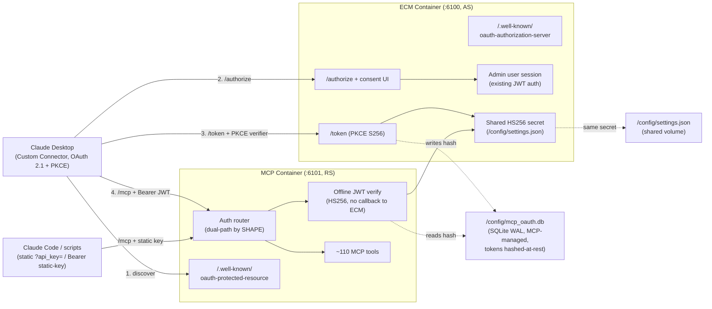

# ADR-009: MCP OAuth 2.1 — ECM as Authorization Server, MCP as Resource Server

- **Status**: Proposed
- **Date**: 2026-05-20 (proposed)
- **Author**: Security Engineer persona (PRIMARY) with IT Architect + Technical Writer personas, encoding the 2026-05-19 team-plan grooming + PO-locked decisions on epic `enhancedchannelmanager-buiqr`
- **Bead**: `enhancedchannelmanager-buiqr.1` (first child of the OAuth 2.1 epic — design lands here before any code child opens)
- **Related**:
  - `enhancedchannelmanager-buiqr` — Epic: Add OAuth 2.1 support to ECM MCP server for Claude Desktop Custom Connector compatibility. **The epic body is the source of truth for the PO-locked decisions; this ADR formalizes them.**
  - `enhancedchannelmanager-buiqr.1` — this ADR's tracker (ADR + STRIDE threat model)
  - `enhancedchannelmanager-ak7xa` — PRECONDITION (closed): gate `mcp-server/tests/` in CI before any OAuth child opens. The OAuth abuse-case tests this ADR motivates would rot silently without this gate
  - `enhancedchannelmanager-buiqr.2` — OAuth state store: SQLite on `/config/mcp_oauth.db` (consumes §6)
  - `enhancedchannelmanager-buiqr.3` — Backend OAuth authorization server: PKCE `/authorize` + `/token` endpoints in ECM (consumes §1, §3)
  - `enhancedchannelmanager-buiqr.4` — OAuth security hardening: rate limiting + open-redirect guards + token hashing (consumes §6, §7)
  - `enhancedchannelmanager-buiqr.5` — OAuth discovery endpoints + `oauth_allow_insecure` flag (consumes §1, §5)
  - `enhancedchannelmanager-buiqr.6` — Hardcoded OAuth client registry for Claude Desktop + Claude Code (consumes §4)
  - `enhancedchannelmanager-buiqr.7` — ECM consent screen: `/oauth/authorize` route + copy + returning-user state + active grants (consumes §3)
  - `enhancedchannelmanager-buiqr.8` — MCP resource server: Bearer-token validator with dual-path-by-shape routing (consumes §2, §3)
  - `enhancedchannelmanager-buiqr.9` — OAuth test infrastructure: abuse cases + dual-path matrix + `.mcp.json` compat + captured-traffic replay (consumes §3, §7)
  - `docs/security/threat_model_mcp_oauth.md` — **the STRIDE threat model that is the security companion to this ADR (same bead `buiqr.1`).** Every decision below maps to one or more threat rows there
  - `docs/architecture.md` — MCP Server section (current static-key auth model this ADR extends; the `settings.json` credential schema in §4 of that doc is the contract the §1 split inherits)
  - `backend/auth/tokens.py` — JWT (HS256) + JTI revocation + `hash_token()` SHA-256 pattern that §3 and §6 mirror
  - `docs/adr/ADR-005-code-security-gating-strategy.md` — the new OAuth routers land subject to CodeQL delta-zero at PR time
  - `docs/adr/ADR-008-interactive-stream-dedup.md` — ADR template/format mirrored here

## Context

ECM's MCP server (`mcp-server/`, default port 6101) today authenticates AI agents with a single static API key (`mcp_api_key` in `/config/settings.json`), accepted either as `?api_key=<key>` or `Authorization: Bearer <key>` (see `docs/architecture.md` → MCP Server → Auth model). This works for Claude Code (`.mcp.json` with a `?api_key=` URL) and for any script. It does **not** work for Claude Desktop's **Custom Connector** UI (Settings → Connectors → Add custom connector), which speaks OAuth 2.1 + PKCE and has no field for a pre-shared key. Today the only Claude Desktop path is the `mcp-remote` bridge, which requires the operator to install Node.js — a non-starter on corporate-managed laptops and a friction wall for less-technical home-server operators.

The epic `buiqr` adds OAuth 2.1 + PKCE so the Custom Connector UI can authenticate **without** the Node.js bridge. This is a security-sensitive change: it introduces a browser-driven authorization flow, a token-issuance surface, a consent screen, and a second authentication path that must coexist with the permanent static-key path. Two authentication paths sharing one resource server is exactly the shape that produces auth-bypass bugs, so the architecture must be locked **before** any code child opens. That is what this ADR does.

### Critical finding that shapes the HTTPS posture

MCP SDK 1.27.0 (already pinned in `mcp-server/`) **rejects `http://` issuer URLs for non-loopback hostnames** in its OAuth discovery handling. The typical ECM deploy shape is `http://<LAN-IP>:6101` — a non-loopback host over plain HTTP — which the SDK refuses. Operators on that shape must front MCP with HTTPS (a reverse proxy: Caddy / nginx / Traefik, or ECM's existing `:6143`). This epic therefore trades "install Node.js" for "set up HTTPS" — better for some operators, worse for others. The PO accepted this trade and locked an opt-in escape hatch (`oauth_allow_insecure`, §5) for operators who knowingly run HTTP-only.

### Why this ADR must land before the code children start

The epic decomposes into ~13 children (`buiqr.2` through `buiqr.13`) spanning the AS endpoints, the RS validator, the SQLite token store, the consent UI, the discovery endpoints, the client registry, the hardening, the test infrastructure, and the docs bundle. The two highest-leverage contract-locks are (a) the **AS/RS split and the offline-verification boundary** (§1, §2) — get this wrong and you couple the two containers at runtime, destroying the failure-isolation envelope — and (b) the **dual-path-by-shape routing rule** (§3) — get this wrong and you ship an auth-bypass. Both must be named once, here, and referenced from the children. This ADR encodes the PO-locked decisions verbatim; it is **not** the place to re-litigate them.

### Architecture overview

## Decision

### §1 — ECM = Authorization Server; MCP = Resource Server (offline verification, no runtime callback)

The OAuth roles are split across the two existing containers along the line that already owns the relevant state:

- **ECM container is the OAuth Authorization Server (AS).** It already owns the admin user session (its existing JWT auth subsystem, `backend/auth/`). The AS hosts:
  - `GET /authorize` — the authorization endpoint, which renders the consent UI (§3).
  - `POST /token` — the token endpoint, which exchanges an authorization code + PKCE verifier for a Bearer JWT.
  - `GET /.well-known/oauth-authorization-server` — RFC 8414 AS metadata.
- **MCP container is the OAuth Resource Server (RS).** It owns the protected resource (the `/mcp` tools surface). The RS hosts:
  - `GET /.well-known/oauth-protected-resource` — RFC 9728 protected-resource metadata, pointing at the ECM AS.
  - The `/mcp` endpoint, which validates the Bearer JWT **offline** on every request.

**Rationale — why ECM is the AS.** OAuth's `/authorize` step requires an authenticated user session to obtain consent. ECM already has that session; MCP does not. Putting the AS in MCP would mean MCP re-implementing or proxying ECM's login, which is both duplicative and a wider attack surface. The user-facing consent screen belongs where the user identity lives.

**Rationale — why offline verification with a shared HS256 secret, NOT a runtime callback.** The RS validates each Bearer JWT by verifying its HS256 signature against a secret read from the shared `/config/settings.json` volume — the same volume the two containers already share for `mcp_api_key` (per `docs/architecture.md`). It does **not** call back to ECM on a per-request basis. This is a deliberate, load-bearing choice:

  - **Performance.** A per-request HTTP callback from MCP to ECM would add a network round-trip to every tool call. AC#11 caps the p50 latency increase at ≤ 5 ms vs the static-key baseline; an in-process HMAC verification meets that, a callback does not.
  - **Failure isolation.** The current MCP server can serve cached/tool operations even under ECM backend stress; coupling token validation to a live ECM call would mean an ECM hiccup takes down all authenticated MCP traffic. Offline verification preserves the existing failure-isolation envelope.
  - **The trade-off is acknowledged:** offline verification means revocation is not instantaneous — a revoked token is rejected only once the RS sees the revocation state (via the shared token store, §6) or the token's short TTL expires. This is the standard JWT trade and is mitigated by short access-token TTLs (§3) and the shared hashed-token store the RS reads (§6). See the threat model's *token-replay* and *secret-rotation* rows.

HS256 (symmetric) is chosen over RS256 (asymmetric) because the two containers already co-locate on one host and share a config volume; a symmetric secret is the simplest primitive that fits the deployment, and it mirrors ECM's existing JWT subsystem (`backend/auth/tokens.py`, `ALGORITHM = "HS256"`). The exit path to RS256 (publish a JWKS from ECM, have MCP fetch + cache it) exists if a future multi-host split needs it, but is out of scope here.

### §2 — Dual-path-by-shape auth routing (route by credential SHAPE, never by fail-cascade)

This is the security-critical routing rule (epic AC#2 / AC#7). The RS's auth router classifies each inbound request by the **shape** of the presented credential and dispatches to exactly one validation path. It **never** tries one path, fails, and falls through to the other.

**The rule:**

| Presented credential | Routed to | Fallback on failure? |
|---|---|---|
| `Authorization: Bearer <JWT-shaped value>` (three base64url segments separated by dots, decodable header with `alg`/`typ`) | **OAuth path only** — offline HS256 verify (§1) | **NO.** A malformed/expired/bad-signature JWT returns 401. It does **NOT** fall through to the static-key check. |
| `?api_key=<value>` query param | **Static-key path only** — compare against `mcp_api_key` | NO. A wrong static key returns 401. |
| `Authorization: Bearer <static-key-prefixed value>` (matches the recognizable static-key shape/prefix, not JWT-shaped) | **Static-key path only** | NO. |
| Neither shape present | 401 with `WWW-Authenticate` pointing at the RS discovery doc | n/a |

**Why route by shape and not by fail-cascade.** A fail-cascade design ("try OAuth; if it fails, try the static key") is an **auth-bypass smell** and the headline threat this whole ADR is built to prevent (threat model §3.6, confused-deputy / privilege-elevation). Two concrete dangers:

  - **Downgrade / confused-deputy.** An attacker who can influence the request could present a deliberately-broken JWT to skip OAuth and have the server "fall back" to evaluating the value as a static key — collapsing the OAuth path's stronger guarantees onto the weaker static-key path. The server must never let a *failed* strong-auth attempt become a *retry* on weaker auth.
  - **Silent guarantee loss.** Even without a malicious actor, fail-cascade means an OAuth misconfiguration (wrong secret, clock skew) silently routes traffic onto the static-key path, masking the OAuth failure and erasing the audit distinction between an OAuth-authenticated session and a static-key session.

**The invariant, stated for the implementer (`buiqr.8`):** *OAuth-validation FAILURE must NEVER fall through to the static-key check.* Once a request is classified as JWT-shaped, its only outcomes are "valid OAuth session" or "401". The classification is on the **shape** of the credential, decided before any validation runs; validation outcome never re-routes. A dedicated regression test (`buiqr.9`) asserts that a JWT-shaped-but-invalid Bearer value is rejected and is **not** evaluated as a static key.

### §3 — Single ECM-admin identity; PKCE S256 only; short-TTL access tokens

- **Single ECM-admin identity model.** Per the PO-locked decision, OAuth grants are made by the **single ECM admin on behalf of the deployment**. The issued token's `sub` claim binds to the admin user. There is no multi-tenant / per-end-user identity in v1 (out of scope, §8). The consent screen (§ below) is the admin saying "this deployment authorizes Claude Desktop."
- **PKCE S256 only.** The `code_challenge_method` accepted at `/authorize` and enforced at `/token` is **`S256` only**. The `plain` method is **rejected with HTTP 400 `invalid_request`** (AC#5). PKCE is mandatory (no non-PKCE authorization-code flow); a missing or `plain` challenge is a 400.
- **Hardcoded client registry; no Dynamic Client Registration.** The set of OAuth clients is a fixed, in-code registry (`buiqr.6`) containing the Claude Desktop and Claude Code client identifiers and their exact redirect URIs. **RFC 7591 Dynamic Client Registration is not implemented** (out of scope, §8). An unknown `client_id` is rejected; a `redirect_uri` that is not an exact match for the registered client's allowlisted URI(s) is rejected (threat model: redirect-URI validation, open-redirect).
- **Token shape and TTL.** Access tokens are HS256 JWTs carrying at minimum `sub` (admin user binding), `jti` (unique id for revocation, mirroring `backend/auth/tokens.py`), `iss` (the ECM AS), `aud` (the MCP RS), `scope` (`mcp`, §8), `iat`, and `exp`. Access-token TTL is **short** (mirroring ECM's existing `ACCESS_TOKEN_EXPIRE_MINUTES = 30` posture; the exact value is `buiqr.3`'s call within that envelope) to bound the offline-verification revocation gap (§1). Refresh handling, if issued, follows the existing one-time-use rotation pattern in `backend/auth/tokens.py`.
- **Consent UI.** Rendered by the AS at the `/authorize` step (`buiqr.7`), shown to the authenticated admin. Copy is the PO-locked single-`mcp`-scope wording: *"Claude Desktop will be able to read and manage your ECM channels, streams, M3U accounts, and EPG sources."* The consent screen pins the requesting client's name (from the hardcoded registry, not from attacker-supplied input) and enforces same-origin / allowlist on any `return_to`-style parameter (threat model: consent-phishing, open-redirect).

### §4 — `oauth_allow_insecure` flag policy

A single boolean in `/config/settings.json`, **default `false`**, governs whether the OAuth surface is offered on plain-HTTP deployments:

- **When `false` (default):** the discovery endpoints (`/.well-known/oauth-authorization-server`, `/.well-known/oauth-protected-resource`) **return 404 on plain HTTP** (non-HTTPS request, non-loopback host). The OAuth flow is effectively off for HTTP-only deploys — the operator sees no discovery metadata, so Claude Desktop's Custom Connector cannot proceed, and they fall back to the (permanent) static-key path or set up HTTPS.
- **When `true`:** the operator has **explicitly opted in** (AC#6) to running OAuth over plain HTTP, accepting the token-interception and replay risk (threat model: token-replay-over-plain-HTTP, HTTP-only deploy). Discovery returns its normal metadata.

**Rationale.** This flag exists because of the MCP SDK 1.27.0 http-issuer rejection finding (see Context). Rather than silently failing on the typical `http://<LAN-IP>:6101` shape, ECM defaults to refusing the insecure posture (404, fail-closed) and makes the operator make an explicit, documented choice to weaken it. The default is the safe value; weakening it is a deliberate act recorded in `settings.json`. The flag never weakens the static-key path — that path is unchanged and HTTP-or-HTTPS as today.

### §5 — Token store: SQLite at `/config/mcp_oauth.db`, MCP-container-managed, hashed-at-rest

- **Location & engine.** A dedicated SQLite database at **`/config/mcp_oauth.db`**, in **WAL mode** (consistent with ECM's other SQLite stores). It is **MCP-container-managed** — the RS owns its lifecycle (`buiqr.2`). This deliberately avoids any runtime HTTP coupling to ECM for token state, preserving the §1 failure-isolation property: the AS issues tokens and writes their hashed records; the RS reads/validates against the same store; neither calls the other at request time.
- **Hashed-at-rest.** Tokens are **never stored in plaintext.** The store holds **SHA-256 hashes** of the token (or of the `jti`, per `buiqr.2`/`buiqr.4` implementation), mirroring the established `hash_token()` pattern in `backend/auth/tokens.py` (`hashlib.sha256(token.encode()).hexdigest()`) and that module's `jti`-based revocation set. A read of `mcp_oauth.db` yields hashes, not bearer credentials — so a compromised store leaks revocation/audit metadata, not usable tokens (threat model: token-store at-rest compromise).
- **Revocation.** Revocation marks the `jti`/hash record revoked; the RS's offline verifier consults the store to reject revoked tokens (the §1 revocation-gap mitigation), exactly mirroring `revoke_token(jti)` in the existing JWT subsystem.

### §6 — Rate limiting; `dispatcharr_api_key` isolation

- **Rate limiting on `/authorize` and `/token`** (AC#9), applied **per-IP and per-user**, to blunt brute-force on the token endpoint, authorization-code-guessing, and consent-spam. Implemented in `buiqr.4`.
- **`dispatcharr_api_key` is never referenced in OAuth code paths.** The Dispatcharr REST API token (`dispatcharr_api_key`, the canonical field per `docs/architecture.md`) is a distinct credential class from the OAuth machinery. No OAuth router, validator, token-store, or discovery handler reads, logs, or forwards `dispatcharr_api_key`. This is enforced by a **CI grep guard** (AC#10) — the OAuth code paths grepped for `dispatcharr_api_key` must return zero hits. This keeps the OAuth trust boundary from leaking into the Dispatcharr trust boundary (threat model: Dispatcharr trust boundary). The historical field-name-collision incident (GH #273, `bd-jmi1c`) is exactly the class of error this guard prevents.

### §7 — Discovery-endpoint hygiene

The two `/.well-known/*` documents (RFC 8414 AS metadata, RFC 9728 protected-resource metadata) are **public, unauthenticated** by spec, and their shape is pinned by snapshot tests (AC#4). They MUST expose only the protocol-required fields (issuer, endpoint URLs, supported `code_challenge_methods` = `["S256"]`, supported scopes = `["mcp"]`, token-endpoint-auth methods) and MUST NOT leak the shared HS256 secret, internal Docker-network hostnames (`ecm:6100`), filesystem paths, version-internal details, or the static `mcp_api_key`. On plain HTTP with `oauth_allow_insecure=false` they return 404 (§4). See the threat model's discovery-endpoint-information-leakage row.

### §8 — Out of Scope (condensed from the epic)

Explicitly **not** built in v1. Each is a future-epic candidate, not a silent omission:

- **Multi-tenant OAuth** — per-end-user grants beyond the single ECM admin. v1 is single-admin-on-behalf-of-deployment (§3).
- **Dynamic Client Registration (RFC 7591)** — the client registry is hardcoded (§3).
- **OIDC / `id_token` issuance** — this is OAuth authorization only, no identity-layer tokens.
- **Per-tool / fine-grained scopes** — single `mcp` scope in v1 (§3). Per-tool scopes are a future epic if asked for.
- **ECM-managed TLS** — HTTPS is operator-supplied (reverse proxy); ECM does not terminate TLS for the OAuth surface (§4 / Context).
- **External OAuth providers** (Google / GitHub / Microsoft login) — ECM is the AS; no federated upstream IdP.
- **WebAuthn / hardware-token binding** on the consent step.
- **Encryption-at-rest for `/config/settings.json` broadly** — only token-specific hashing (§5); the shared HS256 secret and `mcp_api_key` live in `settings.json` as today.
- **Replacement / deprecation of the `?api_key=` static path** — that path is **permanent** (PO-locked); the dual-path matrix (§2) is a permanent CI fixture.
- **Migrating `mcp_api_key` off `settings.json`.**

## Alternatives Considered

| # | Option | Pros | Cons | Portability | Decision |
|---|--------|------|------|-------------|----------|
| 1 | **Chosen — ECM=AS, MCP=RS, offline HS256 verify, dual-path-by-shape** | Consent lives where the user session lives; no per-request callback (meets ≤5 ms AC#11); failure-isolation preserved; shape-routing closes the auth-bypass class | Revocation is not instantaneous (TTL/shared-store mitigated); one shared secret to rotate | High — symmetric secret on a co-located shared volume, no new infra | **Adopted** (PO-locked) |
| 2 | MCP=AS (MCP hosts `/authorize` + consent) | Single container owns the whole OAuth surface | MCP has no user session — would have to proxy/re-implement ECM login; wider attack surface; consent UI divorced from identity | Med | Rejected — consent must live with identity |
| 3 | Per-request runtime callback MCP→ECM to validate every token | Instant revocation; single source of truth at request time | Adds a network round-trip per tool call (blows AC#11); couples MCP availability to ECM; destroys failure isolation | Med | Rejected — perf + isolation |
| 4 | RS256 (asymmetric) instead of HS256 | No shared secret; RS only needs the public key; cleaner multi-host story | More moving parts (JWKS publish/fetch/cache) for two co-located containers that already share a volume; doesn't mirror ECM's existing HS256 JWT subsystem | High | Rejected for v1; documented exit path if multi-host split appears |
| 5 | Fail-cascade dual auth (try OAuth, fall back to static key) | Trivially "just works" for any credential | **Auth-bypass smell** — a failed strong-auth attempt becomes a weak-auth retry; confused-deputy / downgrade; erases audit distinction | n/a | **Rejected — this is the headline threat the ADR exists to prevent (§2)** |
| 6 | OAuth-only (drop the static `?api_key=` path) | One auth path, no dual-path complexity | Breaks every existing Claude Code `.mcp.json` and `?api_key=` script (AC#2, AC#3); PO-locked the static path as permanent | n/a | Rejected — static path is permanent |
| 7 | Plain PKCE allowed (accept `code_challenge_method=plain`) | Marginally simpler clients | `plain` PKCE offers no protection against code interception; S256 is the security baseline | n/a | Rejected — `plain` → 400 (§3) |
| 8 | Discovery always-on regardless of transport | One less flag | Serves an OAuth flow that the SDK will reject over HTTP and that exposes tokens to interception; fails open | n/a | Rejected — fail-closed via `oauth_allow_insecure` (§4) |

## Consequences

### Positive

- **Contract-lock for the OAuth children (`buiqr.2`–`buiqr.9`).** The AS/RS split, the offline-verification boundary, the dual-path-by-shape rule, the token-store location and hashing, the flag policy, and the scope/client model are each named once here and consumed by the children. Divergent implementations have nowhere to hide.
- **The auth-bypass class is closed by construction.** Routing by credential shape, with no fail-cascade, means a failed OAuth validation can never become a static-key retry. The single most dangerous failure mode of dual auth is designed out, not patched after.
- **Performance and failure-isolation envelopes are preserved.** Offline verification keeps the MCP request path in-process; an ECM hiccup does not take down authenticated MCP traffic, and the ≤5 ms latency budget (AC#11) is achievable.
- **The existing static-key path is untouched.** Claude Code `.mcp.json` and `?api_key=` scripts keep working (AC#2, AC#3); the dual-path matrix is a permanent regression fixture.
- **Mirrors existing ECM primitives.** HS256, `jti` revocation, and SHA-256 token hashing all reuse the patterns in `backend/auth/tokens.py` — less novel security code, fewer ways to get it wrong.
- **Fail-closed on insecure transport.** The default `oauth_allow_insecure=false` means an HTTP-only deploy gets 404 discovery, not a silently-insecure OAuth flow.

### Negative

- **One shared HS256 secret to protect and rotate.** Both containers read it from `/config/settings.json`. Compromise of the secret allows token forgery; rotation invalidates all live tokens (acceptable given short TTLs). The threat model's secret-rotation / alg-confusion rows track this; protecting `settings.json` file permissions is the compensating control.
- **Revocation is not instantaneous.** The offline-verification trade means a revoked token is honored until the RS sees the revocation (shared store, §6) or the TTL expires. Mitigated by short TTLs and the shared hashed-token store, but it is a real gap vs a callback design.
- **A second auth path is permanent operational surface.** The dual-path matrix must be maintained forever (PO-locked). Every future change to either path must re-verify the shape-routing invariant.
- **The HTTPS prerequisite shifts operator burden.** Operators on the typical `http://<LAN-IP>:6101` shape must set up a reverse proxy or accept the `oauth_allow_insecure` risk. This is documented (`buiqr.11`) but it is a real friction wall the epic explicitly accepted.

### Neutral / Out of Scope

- **TLS termination** is operator-supplied (reverse proxy); ECM does not manage it for the OAuth surface (§4, §8).
- **CodeQL exposure** of the new OAuth routers is governed by ADR-005's delta-zero gate at PR time — no special carve-out.
- **The static-key path's own threat surface** is unchanged from today and is not re-modeled here beyond the dual-path interaction (§2).

## Exit Path

If a decision here proves wrong:

1. **Soft exit — flip `oauth_allow_insecure` semantics or default.** Single flag; a policy change is a one-line default change plus an ADR addendum and a doc update. Tightening (e.g., remove the HTTP escape hatch entirely) is safe; loosening requires Security re-confirmation.
2. **Soft exit — shorten/lengthen token TTL.** TTL is a config value within the §3 envelope; shortening narrows the revocation gap, lengthening widens it. ADR addendum noting the new value and the revocation-gap analysis.
3. **Additive exit — RS256 / JWKS for multi-host.** If a future deployment splits the two containers across hosts (no shared volume), publish a JWKS from the ECM AS and have the RS fetch+cache it. The token claims (`iss`/`aud`/`jti`/`sub`/`scope`) are algorithm-agnostic; only the signature primitive changes. Own ADR.
4. **Additive exit — per-tool scopes.** The single `mcp` scope is carried as a `scope` claim; adding granular scopes is additive (new scope values, RS-side enforcement per tool). Out of scope for v1 (§8); future epic.
5. **Hard exit — abandon offline verification for a callback.** Only if instant revocation becomes a hard requirement that short TTLs cannot satisfy. Reconsider against the AC#11 latency budget and the failure-isolation envelope. Own ADR; the §1 rationale is the evaluation baseline.

No external vendor relationship is introduced; no new infrastructure beyond the SQLite token store the MCP container already has the volume for.

## Open Questions

### Resolved by the PO-locked epic (no PO action needed here)

- **AS vs RS placement?** → ECM=AS, MCP=RS (§1).
- **Offline verify vs runtime callback?** → Offline, shared HS256 secret, no per-request callback (§1).
- **Dual-auth coexistence policy?** → Route by credential **shape**; never fail-cascade; OAuth failure never falls through to static key (§2).
- **Identity model?** → Single ECM admin; token `sub` binds to admin (§3).
- **PKCE method?** → S256 only; `plain` → 400 `invalid_request` (§3).
- **Dynamic Client Registration?** → No; hardcoded client registry (§3).
- **HTTP posture?** → `oauth_allow_insecure` default false; discovery 404 on plain HTTP unless set (§4).
- **Token store?** → SQLite `/config/mcp_oauth.db`, WAL, MCP-managed, SHA-256 hashed-at-rest (§5).
- **Scope model?** → Single `mcp` scope in v1 (§3, §8).
- **Static `?api_key=` path?** → Permanent, no deprecation (§8); dual-path matrix is a permanent CI fixture.

### Pending — AC#5

- **PO sign-off on this ADR.** AC#5 of `buiqr.1` requires PO sign-off on the ADR **before any implementation child opens.** Status is therefore **Proposed**, not Accepted. PO sign-off flips this to Accepted and unblocks `buiqr.2`–`buiqr.9`.

## References

- Bead `enhancedchannelmanager-buiqr.1` — this ADR's tracker (ADR + STRIDE threat model)
- Bead `enhancedchannelmanager-buiqr` — OAuth 2.1 epic; PO-locked decision record this ADR encodes
- Bead `enhancedchannelmanager-ak7xa` (closed) — CI gate precondition for `mcp-server/tests/`
- Beads `enhancedchannelmanager-buiqr.2` … `enhancedchannelmanager-buiqr.9` — implementation children consuming this ADR
- `docs/security/threat_model_mcp_oauth.md` — STRIDE threat model companion (same bead)
- `docs/architecture.md` → MCP Server — current static-key auth model + `settings.json` credential schema this ADR extends
- `backend/auth/tokens.py` — HS256 + `jti` revocation + `hash_token()` SHA-256 pattern (§3, §5 mirror this)
- `docs/adr/ADR-005-code-security-gating-strategy.md` — CodeQL delta-zero gate covering the new routers
- `docs/adr/ADR-008-interactive-stream-dedup.md` — ADR template/format mirrored here
- RFC 8414 (OAuth 2.0 Authorization Server Metadata), RFC 9728 (OAuth 2.0 Protected Resource Metadata), RFC 7636 (PKCE), RFC 7591 (Dynamic Client Registration — explicitly **not** implemented, §8)

## Revision History

| Date | Bead | Change | Rationale |
|---|---|---|---|
| 2026-05-20 | `enhancedchannelmanager-buiqr.1` | Proposed | Formalizes the PO-locked OAuth split from epic `buiqr` (2026-05-19 grooming). Contract-lock for `buiqr.2`–`buiqr.9`. Status Proposed pending AC#5 PO sign-off before any implementation child opens. |
