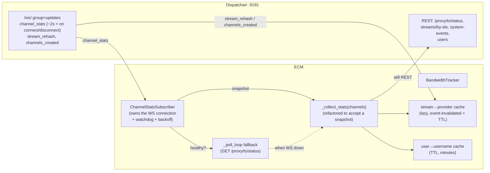

# ADR-013: WebSocket `channel_stats` Subscriber (decouple ECM's live-status driver from polling)

- **Status**: Accepted (PO decisions locked 2026-06-16; implementation pending)
- **Date**: 2026-06-16
- **Author**: IT Architect persona, on behalf of the PO. This ADR specifies a
  design for PO approval; the PO decisions in §Risks & PO Decisions are **open**
  and must be locked before implementation.
- **Bead**: `enhancedchannelmanager-312nk` — ECM WS subscriber + provider/user
  caches to cut Dispatcharr poll volume (telemetry-preserving).
- **Related**:
  - **ADR-011** (`docs/adr/ADR-011-decouple-m3u-refresh-auto-creation.md`) — the
    decouple / event-driven precedent this ADR extends: replace a synchronous
    *pull* with an event-driven *signal*, keep a watermark/fallback for
    correctness, accept no new infrastructure (settings flag + existing loop).
  - `enhancedchannelmanager-1qmn0` (bd-1qmn0) — the 300s M3U-accounts snapshot
    cache the provider resolver already reads
    (`bandwidth_tracker.py:1747` `_maybe_refresh_m3u_accounts`); this ADR's
    stream→provider cache layers *in front of* it, not instead of it.
  - `enhancedchannelmanager-skqln` (bd-skqln) — Stats v2 / `session_telemetry`,
    the write path whose cadence §D2 protects.
  - bd-gy5nd — the URL-hostname provider fallback (`_match_provider_from_url`,
    `bandwidth_tracker.py:453`) the stream→provider cache must reconcile with.
  - `docs/architecture.md` — system overview; the "Stats v2 / bandwidth"
    section is updated on acceptance.

## Context

ECM's single largest source of API traffic to the **live production Dispatcharr
instance** is the bandwidth tracker's poll loop. `BandwidthTracker._poll_loop`
(`backend/bandwidth_tracker.py:1684`) ticks every `stats_poll_interval` (default
**10s**, hot-reloadable via `routers/settings.py` — see `:1435`
`_restart_background_services`, which stops the tracker and constructs a new one
at `:1455`). Each tick runs `_maybe_refresh_channel_map` → `_maybe_refresh_m3u_accounts`
(300s TTL) → `_collect_stats` → `sleep`.

**All four per-tick Dispatcharr round-trips live in `_collect_stats`**
(`:1780`), gated by that one interval:

1. `get_channel_stats()` → `GET /proxy/ts/status` (`dispatcharr_client.py:1206`)
   — **every tick**, always. This is the driver: it produces the
   `{'channels':[...]}` snapshot everything else hangs off.
2. `_resolve_provider_ids` → `get_streams_by_ids()` (`dispatcharr_client.py:458`)
   — batches the active streams' IDs into one call to resolve
   `stream_id → m3u_account_id` (provider attribution).
3. `_collect_channel_events` → `get_system_events()`
   (`dispatcharr_client.py:1224`) — channel-health events
   (`channel_reconnect` / `channel_error` / `stream_switch` / buffering).
4. `get_users()` (`dispatcharr_client.py:1200`) — gated by `need_user_resolution`
   (`:2027`); resolves `user_id → username`.

Then `_write_session_telemetry` (`:3481`) writes **one `session_telemetry` row
per active viewing connection, per observation.**

The PO has rejected the obvious lever — *slow the poll* — because the byte-delta
bandwidth math and the `session_telemetry` granularity degrade as the interval
grows, and the Emby/Plex/Jellyfin session→channel attribution loses resolution.
We need to cut Dispatcharr call volume **without** degrading telemetry, ideally
improving freshness.

### The verified opportunity

Dispatcharr already pushes the **same** snapshot over WebSocket that
`/proxy/ts/status` returns over HTTP. Both are built by the one upstream
function `ChannelStatus.get_basic_channel_info`. The Celery beat task
`fetch_channel_stats` broadcasts, to consumer group `"updates"`, an event:

```json
{"type": "channel_stats", "stats": "{\"channels\":[...],\"count\":N}"}
```

(`stats` is a JSON **string** — it must be `json.loads`-ed, then it is the exact
dict `_collect_stats` already consumes via `stats.get("channels", [])` at
`bandwidth_tracker.py:1802`). Each channel entry carries the fields the pipeline
reads today: `channel_id`, `channel_name`, `state`, `url`, `owner`, `stream_id`,
`stream_name`, `total_bytes`, `avg_bitrate_kbps`, `clients[]` (each `ip_address`
+ `user_id`, capped at 10), `healthy`. The event is pushed **every ~2s** (Celery
beat) **and** on every client connect/disconnect — at effectively no marginal
server cost (Dispatcharr broadcasts it regardless of whether ECM listens).

The endpoint is `ws://<dispatcharr-host>:9191/ws/?token=<JWT>`, behind
`JWTAuthMiddleware`; the consumer joins all clients to group `"updates"`. ECM
already holds and refreshes a Dispatcharr JWT — `DispatcharrClient.access_token`
/ `_refresh_access_token` (`dispatcharr_client.py:122`, `:184`). The libraries
`websockets==16.0` and `aiohttp==3.14.1` are **already in the image** — no new
dependency.

Two more `"updates"` broadcasts are relevant: **`stream_rehash`** and
**`channels_created`** — usable as cache-invalidation signals. **`system-events`
is NOT broadcast over WS** (it is REST-only, and the
`/api/core/system-events/` view supports only a single `event_type=` filter), so
it cannot be WS-replaced or cheaply narrowed without an upstream Dispatcharr
change.

### Why this is an architecture decision (warrants an ADR)

It changes the **trigger model** of ECM's hottest pipeline (from a self-clocked
HTTP poll to an externally-pushed event stream), introduces a **new long-lived
outbound connection** with its own lifecycle and failure modes against a live
production system, **decouples** two cadences that are currently fused
(observation freshness vs. telemetry write rate), and adds two caches whose
**invalidation correctness** the attribution pipeline depends on. Each is a
contract other code and operators rely on.

## Decision

Add a **`ChannelStatsSubscriber`** component to ECM that maintains one
WebSocket connection to Dispatcharr's `"updates"` group and **feeds
`channel_stats` events into the existing `_collect_stats` pipeline as a drop-in
replacement for the `/proxy/ts/status` poll**. The poll is **not removed** — it
becomes the **fallback path**, automatically re-engaged whenever the socket is
not healthy. Two caches (stream→provider, user→username) collapse the remaining
per-observation Dispatcharr calls to *rare*. `system-events` stays on its own
REST poll, unchanged. The whole feature is **behind a setting, default OFF**.

### §D1 — Component shape & integration



- **Ownership / lifetime.** `ChannelStatsSubscriber` is **owned by the
  `BandwidthTracker`** (constructed in `BandwidthTracker.__init__`, started in
  `start()` at `:1527`, stopped in `stop()` at `:1556`). It shares the tracker's
  lifecycle so the existing `set_tracker`/`get_tracker` singleton, the
  settings-driven restart (`routers/settings.py:1455`), and the HTTPS-subprocess
  guard (`main.py:937` — background services run only in the primary process) all
  continue to govern it for free. No new top-level service, no `main.py`
  lifespan change beyond what the tracker already triggers.
- **One connection, one group.** A single WS connection to `"updates"`. ECM
  handles three inbound event `type`s and **ignores all others**:
  - `channel_stats` → `json.loads(stats)` → feed `channels` into the pipeline.
  - `stream_rehash`, `channels_created` → invalidate the stream→provider cache
    (§D3). These are **not** snapshot drivers; they only dirty the cache.
- **Refactor, don't fork, `_collect_stats`.** `_collect_stats` is split so the
  parsing/delta/telemetry body becomes `_process_channel_snapshot(channels,
  observed_at_ms)` taking an already-fetched `channels` list. The poll path calls
  `get_channel_stats()` then `_process_channel_snapshot(...)`; the WS path calls
  `_process_channel_snapshot(...)` directly with the broadcast payload. **One
  code path for everything downstream of the snapshot** — the resolver, the
  byte-delta math, the watch-time accounting, the Emby/Plex/Jellyfin attribution,
  and the telemetry write are untouched. This is the load-bearing safety property:
  the WS path cannot diverge from the poll path because there is only one path.
- **JWT auth on the socket.** The subscriber reuses the client's token:
  connect with `?token={client.access_token}`. On `_ensure_authenticated`-style
  miss, trigger the existing login. On socket close with an auth-class code (or a
  401-equivalent handshake rejection), call `client._refresh_access_token()`
  (`dispatcharr_client.py:184`) and reconnect with the new token. The socket does
  **not** introduce a second credential or auth method — it is the same JWT the
  REST client already manages.

### §D2 — The byte-delta / telemetry-write-cadence tension (explicit)

This is the central design risk and the reason this is not a trivial swap.

`_process_channel_snapshot` does two structurally different things per
observation:

1. **Byte-delta + bandwidth freshness** (`:1868`–`:1879`): `total_bytes` is a
   **cumulative** counter; ECM computes `bytes_now - self._last_bytes[channel_id]`
   (`:1870`). **This math is cadence-independent** — over any wall-clock window
   the deltas sum to the same total regardless of how many observations divided
   it (confirmed by reading `:1870`–`:1879` and the `self._last_bytes =
   current_bytes` commit at `:1978`). Driving it at 2s instead of 10s makes
   bandwidth **fresher and finer-grained at zero correctness cost.** This half we
   *want* event-driven.
2. **Telemetry WRITE** (`_write_session_telemetry`, `:3481`): writes **one row
   per active connection per observation.** At 2s that is **~5× the
   `session_telemetry` insert volume** of the 10s poll — a real write
   amplification against the SQLite journal DB that ADR-007 already governs for
   retention.

**Decision: decouple observation freshness from telemetry write cadence.**

- **Bandwidth / `_last_bytes` / `ChannelBandwidth` / `BandwidthDaily` and the
  in-memory active-channel + client tracking update on EVERY event** (2s) — the
  cumulative-counter property guarantees correctness, and freshness improves.
- **`session_telemetry` writes are throttled to a `telemetry_write_interval`
  (default 10s — preserves today's row cadence)** via a per-tracker
  "last telemetry write" timestamp: an incoming event triggers the heavy write
  path (`_resolve_provider_ids` + `_resolve_attributions` +
  `_write_session_telemetry`) **only if** `now - last_write >=
  telemetry_write_interval`. Between writes, events still refresh bandwidth and
  the in-memory snapshot, so the next write reflects the latest observed state
  (the snapshot is coalesced, not queued).
- **Edge-triggered writes are preserved.** The connect/disconnect-driven events
  (Dispatcharr pushes one on every client connect/disconnect) flush a telemetry
  write immediately when the **active-connection set changes** (a channel becomes
  newly active — `newly_active_channels`, `:1892` — or a client appears/leaves),
  even if the throttle interval has not elapsed. This means session
  start/stop edges are captured at WS latency (sub-second) instead of up to 10s
  late — a **telemetry improvement**, not a regression — while steady-state
  writes stay at ~10s.

Net: bandwidth math is correct and fresher; `session_telemetry` row volume stays
at ~today's level (one write per `telemetry_write_interval`) **plus** edge writes
on session changes; the `get_streams_by_ids` and `get_users` calls fire only on
the throttled write path, not on every 2s event.

### §D3 — `stream_id → provider` cache (lazy, event-invalidated + TTL)

Today `_resolve_provider_ids` (`:2479`) calls `get_streams_by_ids` **every
write**. With §D2 that already drops to per-write (~10s) instead of per-event,
but we can cut it further to **rare**:

- A process-lived `{stream_id → (m3u_account_id, provider_name)}` map.
- **Lazy fill:** a write needs provider IDs for the active streams; **cache
  misses** are batched into ONE `get_streams_by_ids` call (the existing batching
  at `:2089` is preserved — it just skips IDs already cached). Hits cost nothing.
- **Invalidation:** the WS `stream_rehash` and `channels_created` events clear
  the cache (whole-map clear is simplest and correct — these events are
  infrequent; a targeted per-stream invalidation is a possible refinement, not
  required for v1).
- **Safety TTL:** a coarse TTL (e.g. 300s, matching the bd-1qmn0 accounts cache)
  bounds staleness if an invalidation event is ever missed during a WS gap. On
  the poll-fallback path (WS down), the TTL is the only invalidation — acceptable
  because that path is the degraded mode.
- **Reconcile with the bd-gy5nd URL-hostname fallback.** The resolver's
  *secondary* path (`_match_provider_from_url`, `:453`) matches the stream URL's
  hostname against the **m3u_accounts snapshot** (bd-1qmn0's 300s cache,
  `:1747`). That fallback is **unchanged** — it already runs only when the
  stream-id lookup yields nothing (`:779`, `:859`). The new cache sits in front
  of the *stream-id* lookup only; on a cache miss that then also fails the
  by-ids call, control still falls through to the URL-hostname path exactly as
  today. The two caches are independent (stream-id keyed vs. account-hostname
  keyed) and compose without conflict.

After this, `get_streams_by_ids` fires only on cold start, on genuinely new
stream IDs, and right after a `stream_rehash`/`channels_created` — i.e. **rare.**

### §D4 — `user_id → username` cache (TTL, minutes)

Today `get_users()` fires per-poll whenever `need_user_resolution` is true
(`:2027`–`:2034`). Replace the inline fetch with a **TTL cache**
(`user_username_cache_ttl`, default 300s): the write path reads the cached
`{user_id → username}` map and refreshes it only when the TTL has expired (or on
a miss for a user_id not in the map, which triggers one refresh, then serves from
cache for the rest of the TTL). Dispatcharr usernames change rarely; a few
minutes of staleness on a display name is harmless. This eliminates the
per-write `get_users` round-trip in the common (steady-roster) case.

### §D5 — Reconnect / fallback policy (load-bearing for a live system)

The production constraint dominates here: **a WS problem must never degrade ECM
below today's polling behavior**, and must never break Emby/Plex/Jellyfin
session resolution.

- **Default driver = poll; WS is an accelerator.** The `_poll_loop` keeps
  running at `stats_poll_interval`. When the WS is **healthy** (see watchdog),
  the poll's `get_channel_stats()` call is **suppressed** (the WS is feeding
  fresher snapshots; double-driving would double-count nothing — deltas are
  cumulative — but wastes a call). When the WS is **not healthy**, the poll
  resumes calling `get_channel_stats()` exactly as today. The decision of "is
  the WS healthy?" is a single boolean the poll loop reads each tick.
- **Watchdog / heartbeat.** The subscriber tracks `last_event_at`. If no
  `channel_stats` event arrives within a `ws_staleness_timeout` (e.g. 3× the
  expected 2s cadence = 6s, tunable), the socket is declared **stale** → the
  poll path re-engages immediately (no data gap — the very next poll tick, ≤
  `stats_poll_interval`, fetches the snapshot), and the subscriber tears down and
  reconnects. This covers the silent-half-open-socket case where the TCP
  connection lingers but no data flows.
- **Reconnect with backoff.** On any disconnect: exponential backoff with jitter
  (e.g. 1s → 2s → 4s → … cap 30s), reset on a successful event. Backoff protects
  Dispatcharr from a reconnect storm if it restarts. **Throughout backoff, the
  poll path is the live driver** — there is no window where ECM is blind.
- **JWT expiry across the socket.** A close with an auth-class reason triggers
  `_refresh_access_token()` then reconnect with the fresh token (§D1). The REST
  poll fallback uses the same client and the same token, so an expired token
  surfaces and self-heals on whichever path hits it first.
- **Telemetry continuity across a reconnect (byte-delta baselines).** `_last_bytes`
  is keyed by `channel_id` and persists on the tracker across the WS↔poll
  transition (both paths call the same `_process_channel_snapshot`, which owns
  `_last_bytes`). Because `total_bytes` is a **cumulative counter on
  Dispatcharr's side**, a gap in *observation* does not lose bytes: the next
  snapshot (from either path) carries the up-to-date cumulative total, and the
  delta against the retained baseline is correct across the gap. The **only**
  edge case is a channel that *started and stopped entirely within* a WS outage
  shorter than one poll interval — but the poll fallback re-engages within
  `stats_poll_interval` (≤10s) and Dispatcharr's own `system-events` (still
  polled) captures the start/stop, so this is no worse than today's 10s poll
  resolution. **No baseline reset on reconnect.**

### §D6 — Missed / duplicate / out-of-order events

`channel_stats` is a **full snapshot each time**, not a diff. Therefore:

- **Missed events self-heal.** A dropped event is simply superseded by the next
  snapshot ~2s later; cumulative `total_bytes` means no bytes are lost (the next
  delta spans the gap). Confirmed against the cumulative-counter logic at
  `:1870`.
- **Duplicates are idempotent.** Re-processing the same snapshot recomputes the
  same `_last_bytes` deltas to ~0 for unchanged channels; the throttle in §D2
  prevents duplicate `session_telemetry` rows. **No dedup machinery is needed for
  `channel_stats`** (unlike `system-events`, which the existing
  `_seen_buffer_event_ids` LRU at `:1480` already de-dups on its own REST path —
  unchanged).
- **Ordering is irrelevant** for a snapshot stream: only the latest matters. We
  process events in arrival order and let the newest win.

### §D7 — Rollout / safety

- **Behind a setting, default OFF.** `use_ws_channel_stats: bool = False` on
  `DispatcharrSettings` (settings.json — no DB migration, same mechanism
  `stats_poll_interval` uses, `routers/settings.py:93`). The
  settings-restart path (`_restart_background_services`, `:1435`) already
  reconstructs the tracker, so toggling the flag re-reads it on the next
  start — the subscriber starts/stops with the tracker. **Rollout sequence:**
  ship default-OFF (poll only, zero behavior change) → opt-in for the PO's
  instance to soak → flip default ON in a later release once soaked. The
  `stats_poll_interval` poll is **never removed** — it is the permanent
  fallback substrate, not a transitional one.
- **Interplay with `stats_poll_interval`.** Unchanged as a setting; its meaning
  shifts from "the driver cadence" to "the fallback cadence + the upper bound on
  detection latency when the WS is down." Operators who lower it for faster
  fallback still can. The two telemetry-relevant intervals
  (`telemetry_write_interval`, `user_username_cache_ttl`) are new, additive, and
  defaulted to preserve today's behavior.
- **Observability** (SRE-aligned; ADR-006/SLO-friendly). Log, with the existing
  `[BANDWIDTH]` / a new `[WS]` prefix and lazy `%` formatting:
  WS connected / disconnected (with close code), reconnect attempts + backoff
  state, `events/sec` (debug or a Prometheus counter
  `ecm_ws_channel_stats_events_total`), `fallback_activations_total` (the
  load-bearing one — a rising count means the WS is flapping and ECM is silently
  running on the poll), and `ws_healthy` as a gauge. A fallback activation is a
  WARN, not a silent debug line — operators need to see when the accelerator is
  off.

### §D8 — What stays unchanged

- **`system-events` REST poll** — `_collect_channel_events` →
  `get_system_events` (`:2585`, `dispatcharr_client.py:1224`). Not on the WS
  broadcast inventory, single-`event_type` filter only; **left exactly as-is**,
  including its `_seen_buffer_event_ids` cross-poll dedup LRU (`:1480`). This
  call continues at the telemetry-write cadence (§D2), not per-event.
- **The periodic ECM-side reads** — `_maybe_refresh_channel_map` (`:1707`,
  channels) and `_maybe_refresh_m3u_accounts` (`:1747`, the bd-1qmn0 300s
  accounts snapshot). Unchanged; they are ECM-internal/rate-limited already.
- **The entire downstream pipeline** — provider resolution, Emby/Plex/Jellyfin
  attribution (`_resolve_attributions`, `:2120`), watch counts/time, the
  `session_telemetry` writer schema. Unchanged — it runs behind
  `_process_channel_snapshot` regardless of who fed the snapshot.
- **`ECM_STATS_TELEMETRY_OPT_OUT`** — the Stats v2 **kill-switch** (`:1181`,
  `:2075`). Untouched; still short-circuits the heavy write path when an operator
  disables Stats v2. It is **not** a cadence knob and is not repurposed here.

## Alternatives Considered

| Option | Pros | Cons | Decision |
|--------|------|------|----------|
| **Keep polling, just slow `stats_poll_interval`** | Zero new code; one setting | Degrades bandwidth granularity, `session_telemetry` resolution, and Emby attribution; the PO has explicitly rejected this | **Rejected** — degrades telemetry, which is the constraint |
| **`ECM_STATS_TELEMETRY_OPT_OUT` to cut calls** | Already exists; removes 3 of 4 calls | It is a feature kill-switch — it *disables Stats v2 entirely* (no provider/event/telemetry data). Cuts calls by deleting the feature, not by making it cheaper | **Rejected** — kills the capability we are trying to preserve |
| **Ask Dispatcharr to broadcast `system-events` over WS / add a multi-`event_type` filter** | Would let ECM drop the system-events poll too | Out of ECM's control (upstream change); not on the `"updates"` inventory today | **Out of scope** — file upstream; design around the REST poll for now (§D8) |
| **WS subscriber as the SOLE driver (remove the poll)** | Simplest mental model; one path | A live production system with no fallback: any WS outage blinds ECM's telemetry and bandwidth tracking. Unacceptable for the stated "design for safety/fallback" constraint | **Rejected** — poll is retained as the permanent fallback (§D5) |
| **Drive telemetry writes at the full 2s event cadence** | Maximum freshness | ~5× `session_telemetry` write amplification against the SQLite journal DB (ADR-007 retention pressure) for negligible analytic benefit | **Rejected** — §D2 throttles writes to ~10s + session edges |
| **Standalone WS service / separate process** | Independent scaling | ECM is a single-process container (per the house model); a second process adds an IPC + lifecycle surface for no benefit. ADR-011/ADR-012 both rejected new infrastructure for single-process scope | **Rejected** — subscriber lives inside the tracker (§D1) |

## Consequences

### Positive

- **Most of ECM's Dispatcharr heartbeat traffic disappears.** Expected
  per-observation call-volume reduction (see §Effort table for sizing):
  - `GET /proxy/ts/status` (the status poll): **→ ~0** while the WS is healthy
    (the WS *is* the snapshot; the poll fires only during fallback).
  - `get_streams_by_ids`: **per-write → rare** (cache + event invalidation, §D3).
  - `get_users`: **per-write → rare** (TTL cache, §D4).
  - `get_system_events`: **unchanged** (REST-only, §D8) — but now at the
    telemetry-write cadence (~10s), not per-event.
  - Net: the four-call-per-10s heartbeat collapses toward **system-events only**,
    with provider/user calls amortized to near-zero in steady state.
- **Telemetry is preserved and in places improved.** Bandwidth is fresher (2s vs
  10s) at zero correctness cost; session start/stop edges are captured at WS
  latency via edge-triggered writes (§D2); `session_telemetry` row volume holds
  at ~today's level.
- **No new dependency, no new infrastructure, no new process.** `websockets` /
  `aiohttp` already in the image; subscriber lives in the tracker; flag in
  settings.json (no migration).
- **Safe by construction.** Default OFF; permanent poll fallback; single
  downstream code path (`_process_channel_snapshot`) so the WS path cannot drift
  from the audited poll path.

### Negative / accepted

- **A new long-lived outbound connection to a live production system**, with its
  own failure modes (half-open sockets, reconnect storms, token expiry mid-stream).
  Mitigated by the watchdog + backoff + jitter + permanent fallback (§D5), but it
  is genuinely new operational surface that must be observable (§D7).
- **Two new caches with correctness obligations.** The stream→provider cache is
  only as correct as its invalidation; a *missed* `stream_rehash` during a WS gap
  could serve a stale provider until the safety TTL expires (≤300s). Bounded and
  acceptable, but real.
- **`_collect_stats` refactor touches the hottest, most heavily-tested path in
  the tracker.** The split into `_process_channel_snapshot` must be behavior-
  preserving; this is where the regression risk concentrates (QA: the existing
  poll-path tests must pass unchanged, and the WS path must be proven to produce
  byte-identical downstream state for the same snapshot).
- **WS↔poll dual-driver coordination** is a small but real concurrency surface
  (both could call `_process_channel_snapshot`); it must be serialized (e.g. an
  `asyncio.Lock` around snapshot processing) so a fallback poll and a late WS
  event cannot interleave and corrupt `_last_bytes`.

### Exit path

- **Whole feature**: flip `use_ws_channel_stats` OFF → ECM reverts to pure
  polling, identical to pre-ADR behavior, no restart-of-Dispatcharr required, no
  data migration. The subscriber code is dormant. To fully back out: drop the
  subscriber construction from `BandwidthTracker.__init__`, the two cache fields,
  and the setting. No schema to unwind.
- **Caches only**: each cache can be independently neutered (TTL → 0, or
  always-miss) to fall back to per-write fetches without removing the WS driver.

## Effort / decomposition

Four sequenced implementation beads under `enhancedchannelmanager-312nk`. Sizes
per the project Small/Medium/Large vocabulary (no calendar estimates).

| # | Bead (proposed) | Scope | Size | Sequence / depends on |
|---|-----------------|-------|------|-----------------------|
| **312nk.1** | **Refactor `_collect_stats` → `_process_channel_snapshot`** | Behavior-preserving split: poll path calls `get_channel_stats()` then the new snapshot processor; all existing tests pass unchanged. Adds the snapshot-processing `asyncio.Lock`. No WS yet. | **M** | First — everything else builds on the seam. No dependency. |
| **312nk.2** | **`ChannelStatsSubscriber` + connect/fallback/observability, behind `use_ws_channel_stats` (default OFF)** | The WS client, JWT-on-socket + refresh, watchdog/staleness, backoff+jitter, WS-healthy boolean that suppresses the poll's `get_channel_stats`, fallback-activation + connect/disconnect logging/metrics. Drives `_process_channel_snapshot` from `channel_stats`. **No** telemetry-cadence change yet (writes still every event — explicitly temporary, gated OFF). | **L** | Depends on .1. The load-bearing bead. |
| **312nk.3** | **Decouple telemetry write cadence (§D2)** | `telemetry_write_interval` throttle + edge-triggered writes on active-connection-set change; confirm byte-delta cadence-independence with tests. | **M** | Depends on .2 (needs the event driver to throttle). |
| **312nk.4** | **stream→provider cache (§D3) + user→username cache (§D4)** | Lazy fill + `stream_rehash`/`channels_created` invalidation + safety TTL; reconcile with the bd-gy5nd URL-hostname fallback; user TTL cache. Drops `get_streams_by_ids`/`get_users` to rare. | **M** | Depends on .2 (cache invalidation needs the WS event handlers) and .3 (caches are read on the throttled write path). Can land same release as .3. |

**Expected % call-volume reduction (steady state, WS healthy):** of the four
per-tick Dispatcharr calls, the status poll (the always-fires one) goes to ~0,
`get_streams_by_ids` and `get_users` go to rare (cache-amortized), and
`get_system_events` is unchanged but de-multiplied from per-event to
per-write. The dominant heartbeat — the status poll firing every 10s forever —
is **eliminated** while the WS is up; what remains is the system-events poll plus
occasional cache-fill calls. This is the bulk of ECM's Dispatcharr API volume.

## Risks & PO Decisions

| Risk | Likelihood | Impact | Mitigation |
|------|-----------|--------|------------|
| `_collect_stats` refactor regresses the audited poll path | Medium | High | Single seam (`_process_channel_snapshot`); existing poll tests must pass byte-for-byte unchanged (312nk.1 gate); QA proves WS and poll produce identical downstream state |
| WS flaps → ECM silently runs degraded on poll | Medium | Medium | `fallback_activations_total` WARN metric (§D7); poll is a full-fidelity fallback, not a degraded one — "degraded" here only means "lost the 2s freshness," telemetry stays correct |
| Missed `stream_rehash` during a WS gap → stale provider attribution | Low | Low | Safety TTL (≤300s) bounds staleness; URL-hostname fallback still corrects unresolved cases (§D3) |
| Reconnect storm if Dispatcharr restarts | Low | Medium | Exponential backoff + jitter, cap 30s (§D5) |
| Dual-driver race on `_last_bytes` | Low | Medium | `asyncio.Lock` around snapshot processing (312nk.1) |

### DECISIONS NEEDED — RESOLVED (PO, 2026-06-16)

1. **`telemetry_write_interval` default.** **RESOLVED: 10s** + edge-triggered
   writes on session start/stop. Preserves today's `session_telemetry` row
   cadence (§D2).

2. **Default-ON timing.** **RESOLVED: ship default OFF**, opt-in soak on the
   PO's instance, flip default ON in a later release once soaked.

3. **Fallback semantics — suppress the poll's status call when WS is healthy?**
   **RESOLVED: yes, suppress.** Per the agreed middle path, the poll keeps firing
   during the opt-in soak (cross-validation) and is suppressed once the feature
   defaults ON.
