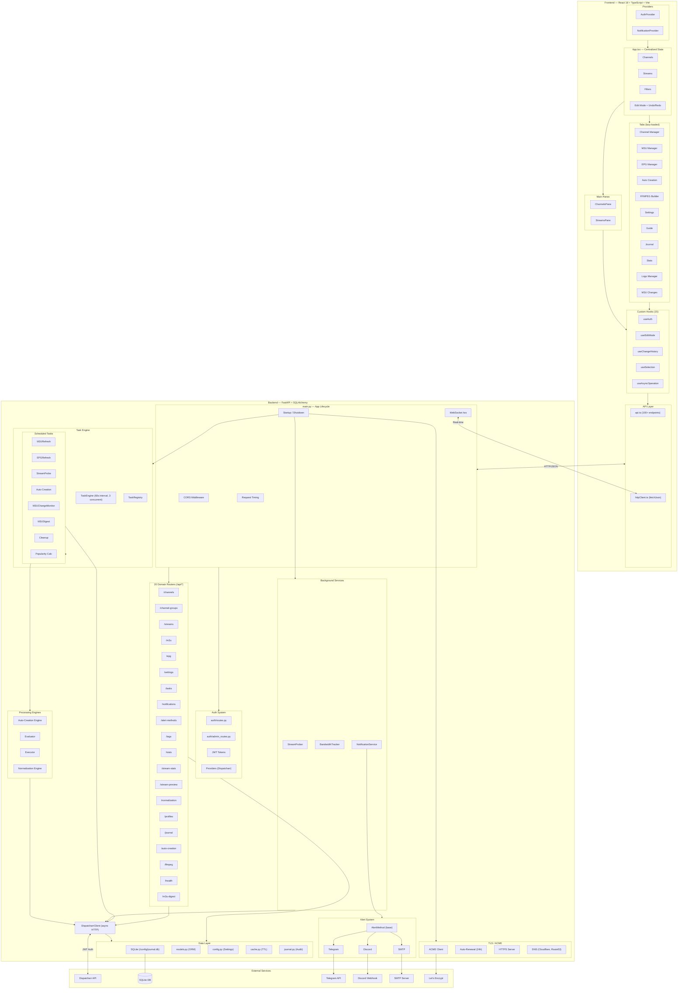

# ECM Architecture

## System Overview



## Request Flow

```
Browser → Frontend (React SPA on :6100/static/)
       → HTTP/JSON → FastAPI (:6100/api/*)
                    → CORS middleware → Auth check → Router endpoint
                    → DispatcharrClient → Dispatcharr API (upstream)
                    → SQLAlchemy ORM → SQLite (/config/journal.db)
       → WebSocket → /ws (real-time status updates)
```

## Background Processing

```
Startup → TaskEngine (checks every 60s, max 3 concurrent)
        → M3U Refresh, EPG Refresh, Stream Probe, Auto-Creation,
          M3U Change Monitor, M3U Digest, Cleanup, Popularity Calc
        → NotificationService → AlertMethods (Discord, SMTP, Telegram)
        → StreamProber (health checks, bitrate sampling)
        → BandwidthTracker (bandwidth stats polling)
        → TLS Renewal (24h check interval)
```

## Key Boundaries

| Boundary | Frontend | Backend |
|-|-|
| State | App.tsx useState (no Redux) | SQLite + in-memory cache |
| Auth | AuthContext + JWT in cookies | JWT validation + session management |
| API | api.ts (100+ named exports) | 20 routers in routers/ |
| Real-time | useStatusWebSocket hook | WebSocket /ws endpoint |
| Config | localStorage (filters, prefs) | /config/settings.json |
