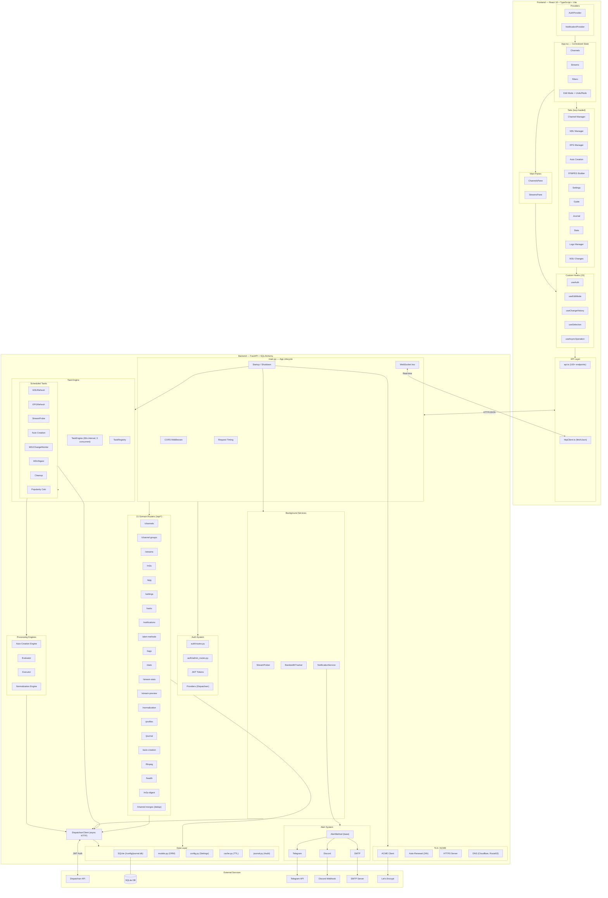
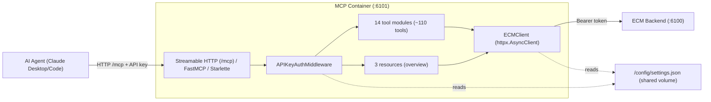

# ECM Architecture

## System Overview


```mermaid
graph TB
    subgraph Frontend["Frontend — React 18 + TypeScript + Vite"]
        direction TB

        subgraph Providers["Providers"]
            AuthProvider
            NotificationProvider
        end

        subgraph AppState["App.tsx — Centralized State"]
            Channels
            Streams
            Filters
            EditMode["Edit Mode + Undo/Redo"]
        end

        subgraph Tabs["Tabs (lazy-loaded)"]
            ChannelManager["Channel Manager"]
            M3UManager["M3U Manager"]
            EPGManager["EPG Manager"]
            AutoCreation["Auto Creation"]
            FFMPEGBuilder["FFMPEG Builder"]
            Settings["Settings"]
            Guide & Journal & Stats
            LogoManager["Logo Manager"]
            M3UChanges["M3U Changes"]
        end

        subgraph Panes["Main Panes"]
            ChannelsPane
            StreamsPane
        end

        subgraph Hooks["Custom Hooks (15)"]
            useAuth & useEditMode & useChangeHistory
            useSelection & useAsyncOperation
        end

        subgraph Services["API Layer"]
            api["api.ts (100+ endpoints)"]
            httpClient["httpClient.ts (fetchJson)"]
        end

        Providers --> AppState
        AppState --> Tabs
        AppState --> Panes
        Tabs --> Hooks
        Panes --> Hooks
        Hooks --> Services
    end

    subgraph Backend["Backend — FastAPI + SQLAlchemy"]
        direction TB

        subgraph MainApp["main.py — App Lifecycle"]
            CORS["CORS Middleware"]
            ReqTiming["Request Timing"]
            WebSocket["WebSocket /ws"]
            Startup["Startup / Shutdown"]
        end

        subgraph Auth["Auth System"]
            AuthRoutes["auth/routes.py"]
            AdminRoutes["auth/admin_routes.py"]
            AuthTokens["JWT Tokens"]
            AuthProviders["Providers (Dispatcharr)"]
        end

        subgraph Routers["21 Domain Routers (/api/*)"]
            direction LR
            R_channels["/channels"]
            R_groups["/channel-groups"]
            R_streams["/streams"]
            R_m3u["/m3u"]
            R_epg["/epg"]
            R_settings["/settings"]
            R_tasks["/tasks"]
            R_notifications["/notifications"]
            R_alerts["/alert-methods"]
            R_tags["/tags"]
            R_stats["/stats"]
            R_streamstats["/stream-stats"]
            R_preview["/stream-preview"]
            R_norm["/normalization"]
            R_profiles["/profiles"]
            R_journal["/journal"]
            R_auto["/auto-creation"]
            R_ffmpeg["/ffmpeg"]
            R_health["/health"]
            R_m3udigest["/m3u-digest"]
            R_dedup["/channel-merges (dedup)"]
        end

        subgraph TaskSystem["Task Engine"]
            TaskEngine["TaskEngine (60s interval, 3 concurrent)"]
            TaskRegistry["TaskRegistry"]
            subgraph Tasks["Scheduled Tasks"]
                M3URefresh & EPGRefresh & StreamProbe
                AutoCreate["Auto Creation"]
                M3UChangeMonitor & M3UDigest
                Cleanup & PopularityCalc["Popularity Calc"]
            end
        end

        subgraph BackgroundServices["Background Services"]
            StreamProber["StreamProber"]
            BandwidthTracker["BandwidthTracker"]
            NotifService["NotificationService"]
        end

        subgraph AlertSystem["Alert System"]
            AlertBase["AlertMethod (base)"]
            Discord & SMTP & Telegram
        end

        subgraph TLS["TLS / ACME"]
            AcmeClient["ACME Client"]
            CertRenewal["Auto-Renewal (24h)"]
            HTTPSServer["HTTPS Server"]
            DNSProviders["DNS (Cloudflare, Route53)"]
        end

        subgraph Engines["Processing Engines"]
            AutoEngine["Auto-Creation Engine"]
            AutoEval["Evaluator"]
            AutoExec["Executor"]
            NormEngine["Normalization Engine"]
        end

        subgraph Data["Data Layer"]
            DB["SQLite (/config/journal.db)"]
            Models["models.py (ORM)"]
            Config["config.py (Settings)"]
            Cache["cache.py (TTL)"]
            JournalLog["journal.py (Audit)"]
        end

        Client["DispatcharrClient (async HTTP)"]

        MainApp --> Auth
        MainApp --> Routers
        Startup --> TaskSystem
        Startup --> BackgroundServices
        Startup --> TLS
        Routers --> Client
        Routers --> Data
        TaskSystem --> Tasks
        Tasks --> Client
        Tasks --> Engines
        BackgroundServices --> Client
        NotifService --> AlertSystem
        AlertBase --> Discord & SMTP & Telegram
        Engines --> Client
        Client --> Data
    end

    subgraph External["External Services"]
        Dispatcharr["Dispatcharr API"]
        SQLiteDB[("SQLite DB")]
        TelegramAPI["Telegram API"]
        DiscordWebhook["Discord Webhook"]
        SMTPServer["SMTP Server"]
        LetsEncrypt["Let's Encrypt"]
    end

    Services <-->|"HTTP/JSON"| MainApp
    WebSocket <-->|"Real-time"| httpClient
    Client <-->|"JWT Auth"| Dispatcharr
    DB --- SQLiteDB
    Telegram --> TelegramAPI
    Discord --> DiscordWebhook
    SMTP --> SMTPServer
    AcmeClient --> LetsEncrypt
```

## Request Flow

```
Browser → Frontend (React SPA on :6100/static/ by default)
       → HTTP/JSON → FastAPI (:6100/api/* by default)
                    → CORS middleware → Auth check → Router endpoint
                    → DispatcharrClient → Dispatcharr API (upstream)
                    → SQLAlchemy ORM → SQLite (/config/journal.db)
       → WebSocket → /ws (real-time status updates)
```

## Background Processing

```
Startup → TaskEngine (checks every 60s, max 3 concurrent)
        → M3U Refresh, EPG Refresh, Stream Probe, Auto-Creation,
          M3U Change Monitor, M3U Digest, Cleanup, Popularity Calc
        → NotificationService → AlertMethods (Discord, SMTP, Telegram)
        → StreamProber (health checks, bitrate sampling)
        → BandwidthTracker (bandwidth stats polling)
        → TLS Renewal (24h check interval)
```

## Key Boundaries

| Boundary | Frontend | Backend |
|-|-|
| State | App.tsx useState (no Redux) | SQLite + in-memory cache |
| Auth | AuthContext + JWT in cookies | JWT validation + session management |
| API | api.ts (100+ named exports) | 20 routers in routers/ |
| Real-time | useStatusWebSocket hook | WebSocket /ws endpoint |
| Config | localStorage (filters, prefs) | /config/settings.json |

---

## Auto-Creation Pipeline Internals

`AutoCreationEngine` orchestrates a per-stream pipeline. For each stream in scope it builds a `StreamContext`, evaluates it against a rule via `ConditionEvaluator`, and on match hands the matched actions to `ActionExecutor`.

```
AutoCreationEngine.run_pipeline() / run_rule()
  ├─ _load_existing_data · _load_rules · _fetch_streams · _load_stream_stats
  ├─ _apply_global_filters
  ├─ _probe_unprobed_streams → _batch_probe_streams          (ffprobe fill-in)
  │
  ├─ _process_streams:                                       [main loop, per stream]
  │    ├─ build StreamContext(stream, existing_data, stats)
  │    ├─▶ ConditionEvaluator.evaluate(StreamContext, rule)
  │    │       └─ returns match? action list?
  │    └─▶ ActionExecutor.execute(Action, ExecutionContext)
  │            ├─ _execute_create_channel   _execute_create_group
  │            ├─ _execute_merge_streams    _execute_assign_logo
  │            ├─ _execute_assign_epg       _execute_assign_tvg_id
  │            ├─ _execute_assign_profile   _execute_assign_channel_profile
  │            ├─ _add_stream_to_channel    _update_channel
  │            ├─ _ensure_channel_m3u_counts _match_epg_data
  │            └─ reload_epg_data           verify_epg_assignments
  │            → returns ActionResult
  │
  ├─ _reorder_channel_streams · _reconcile_orphans · _refresh_dummy_epg_and_retry
  └─ rollback_execution   [on failure — undoes created entities]
```

**Data currency (5 DTOs threaded through the pipeline):**

| DTO | Source | Role |
|-|-|-|
| `StreamContext` | `auto_creation_evaluator.py` | Stream + existing data + stats — input to evaluation |
| `Action` / `ActionType` | `auto_creation_schema.py` | The verb + its parameters |
| `ExecutionContext` | `auto_creation_executor.py` | Per-run rollback tracker |
| `ActionResult` | `auto_creation_executor.py` | Outcome reported back up the chain |

`AutoCreationEngine` has exactly three production collaborators: `ConditionEvaluator`, `ActionExecutor`, and `init_auto_creation_engine`. Everything else in its call graph is tests.

## Stream Deduplication Pipeline (v0.17.1)

The interactive stream-to-channel deduplication feature (ADR-008) intercepts three trigger paths — drag-drop, "Add Stream" button, and bulk M3U refresh — and offers the operator a choice to **merge into an existing channel** rather than creating a duplicate.

### Database tables (migration 0014)

Two tables land in `journal.db`:

| Table | Purpose |
|-|-|
| `pending_merges` | Queue of pending dedup decisions. Rows carry `status` ∈ {`pending`, `merged`, `dismissed`}. Terminal rows are retained indefinitely as audit history. |
| `pending_merge_journal` | Discrete audit trail. One row per accept / dismiss / enqueue action, with queryable columns for `actor_token_id`, `action_type`, `trigger_context`, `confidence_score`, and timestamps. Separate from the existing `journal_entries` table. |

The `pending_merges` table uses a partial unique index on `(stream_name, candidate_channel_id) WHERE status='pending'` to prevent duplicate queue rows from repeat M3U imports of the same stream.

### Matcher service

`backend/services/dedup_matcher.py` implements `find_candidate(stream_name, candidates, threshold) -> MatchResult | None` using RapidFuzz `token_set_ratio`. A hard `CONFIDENCE_FLOOR = 0.60` is enforced in the matcher regardless of the operator-configured threshold — the matcher will never emit a candidate below 60% confidence (ADR-008 §D2). The Pydantic validator for `dedup_threshold` in `backend/config.py` imports this constant so the two layers stay locked to the same floor value.

### API surface (`backend/routers/channel_merges.py`)

Four endpoints under `/api/channel-merges/*` (ADR-008 §D1 D4-override, plural-noun path per the style guide):

```
GET  /api/channel-merges/candidates   — synchronous lookup (cacheable, idempotent)
GET  /api/channel-merges              — paginated queue list (status filter: pending/merged/dismissed)
POST /api/channel-merges/{id}/accept  — operator confirms merge (idempotent on terminal merged)
POST /api/channel-merges/{id}/dismiss — operator rejects candidate (idempotent on terminal dismissed)
```

Response envelopes follow the ECM flat-outcome pattern (no top-level `data` wrapper), matching the precedent at `POST /api/channels/merge`.

### Bulk M3U refresh hook (BD-F)

`backend/services/m3u_dedup_hook.py` is wired into `AutoCreationEngine._process_streams()` when `triggered_by='m3u_refresh'`. After the executor's exact and normalized channel-name lookups fail and before a new-channel `create_channel` call, the hook:

1. Calls `dedup_matcher.find_candidate()` with the operator-configured `dedup_threshold`.
2. On a match above the threshold: INSERTs a `pending_merges` row with `trigger_context='m3u_refresh'` and signals the executor to SKIP the new-channel creation.
3. On a collision with an existing pending row (§D5 partial unique index): logs at INFO and returns "skip creation" — the existing row stays authoritative.
4. Increments the `ecm_pending_merges_queue_depth_added_total` counter (BD-M locked metric contract).

The hook fires only on the M3U-refresh path. Scheduled / manual auto-creation runs are not affected.

### Interactive trigger flow

For drag-drop and Add Stream triggers:

```
Operator action (drag-drop / right-click)
  └─ Frontend calls GET /api/channel-merges/candidates?stream_name=X&group_id=Y
       └─ Router → dedup_matcher.find_candidate()
            ├─ candidate found → StreamDedupModal displayed
            │    ├─ operator clicks "Merge into existing channel"
            │    │    └─ POST /api/channel-merges/{id}/accept
            │    │         → Dispatcharr merge call → pending_merge_journal row
            │    └─ operator clicks "Create new channel"
            │         └─ POST /api/channel-merges/{id}/dismiss → pending_merge_journal row
            └─ no candidate → new-channel creation proceeds as normal
```

### MCP tools (BD-O / BD-P)

Three new tools in `mcp-server/tools/dedup.py` expose the dedup queue to AI agents (ADR-008 §D7):

| Tool | Mirrors |
|-|-|
| `list_pending_channel_merges(group_id?, status?)` | `GET /api/channel-merges?status=…` |
| `accept_channel_merge(merge_id)` | `POST /api/channel-merges/{id}/accept` |
| `dismiss_channel_merge(merge_id)` | `POST /api/channel-merges/{id}/dismiss` |

The existing `add_stream` MCP tool is extended (BD-P) with a `dedup_action` parameter: `prompt` (return candidates for agent decision), `force_new` (skip dedup), or `merge_if_found` (auto-accept if above threshold). MCP-driven actions record `trigger_context='mcp_tool'` in the audit journal.

### Boundaries

The interactive dedup pipeline and the auto-creation pipeline's own collision detection (`match_scope_target_group` / separate-not-merge, migration 0002 / bd-r9mtd) are **independent systems** that do not share a matcher. The interactive dedup path is the *attended* (operator-driven) surface; the auto-creation path is the *unattended* surface. A shared matcher service is a deferred backlog candidate.

See also: ADR-008 (`docs/adr/ADR-008-interactive-stream-dedup.md`), API reference (`docs/api.md` → Channel Merges section), operator guide (`docs/user_guide/channels-streams/stream-dedup.md`).

---

## Normalization ↔ Auto-Creation Coupling

The normalization and auto-creation subsystems are architecturally independent and coupled only via a singleton factory:

```
AutoCreationEngine._process_streams()
    └─ calls get_normalization_engine()         [singleton factory]
            └─ returns NormalizationEngine
                    ├─ normalize()              [public API]
                    ├─ extract_core_name()
                    ├─ test_rule() / test_rules_batch()
                    ├─ get_all_rules() / invalidate_cache()
                    └─ [internals: _load_rules, _match_condition, _match_compound_conditions,
                                    _match_tag_group, _apply_action, _apply_else_action,
                                    _apply_rules_single_pass, _apply_legacy_custom_tags]
```

Auto-creation treats normalization as an opaque service: it obtains the engine via the factory and calls `normalize()`. No shared types, no shared state. The only other production caller of `NormalizationEngine` is `scripts/normalization_canary.py`.

## Frontend Edit-Commit UX Pattern

UI changes are not applied immediately. They're staged in memory, undo/redo-tracked, then flushed to the backend as a single bulk operation:

```
User interaction
  └─ useEditMode              [stages change in memory]
       │
       ├─ useChangeHistory    [undo/redo]
       │
       └─ on commit:
            ├─ api.bulkCommit()              → POST /api/channels/bulk-commit
            ├─ api.bulkMergeChannels()       → POST /api/channels/bulk-merge
            └─ api.bulkAssignChannelNumbers() → POST /api/channels/assign-numbers
                  └─ backend atomically applies N operations
```

Why: the channel list spans 27k+ streams. Per-change network calls would be unusably slow and would prevent the preview-and-commit UX entirely. Staging enables undo/redo, preview diffs, pre-commit validation, and rollback on bulk failure.

**Lazy per-group stream loading** is a related optimization — the 27k streams are never loaded at once. Streams are fetched on demand per channel group as the user navigates.

## MCP Server

A separate container (`mcp-server/`, default port 6101) exposes ECM operations to AI agents via the Model Context Protocol. Runs as a Starlette app with the Streamable HTTP transport — a single `/mcp` endpoint; Claude Desktop (via the `mcp-remote` bridge) and Claude Code connect over HTTP.


```mermaid
graph LR
    Agent["AI Agent (Claude Desktop/Code)"]

    subgraph MCPContainer["MCP Container (:6101)"]
        Transport["Streamable HTTP (/mcp) / FastMCP / Starlette"]
        AuthMW["APIKeyAuthMiddleware"]
        Tools["14 tool modules (~110 tools)"]
        Resources["3 resources (overview)"]
        Client["ECMClient (httpx.AsyncClient)"]

        Transport --> AuthMW
        AuthMW --> Tools
        AuthMW --> Resources
        Tools --> Client
        Resources --> Client
    end

    ECMBackend["ECM Backend (:6100)"]
    Settings["/config/settings.json (shared volume)"]

    Agent -->|"HTTP /mcp + API key"| Transport
    Client -->|"Bearer token"| ECMBackend
    AuthMW -.reads.-> Settings
    Client -.reads.-> Settings
```

**Tool modules (15 domains):** `channels`, `channel_groups`, `streams`, `m3u`, `epg`, `auto_creation`, `export`, `ffmpeg`, `tasks`, `stats`, `system`, `notifications`, `profiles`, `normalization`, `dedup`.

**Resources (read-only):** `ecm://stats/overview`, `ecm://channels/summary`, `ecm://tasks/status`.

**Auth model — two separate keys:**

- **Inbound (MCP client → MCP server):** API key from `settings.json:mcp_api_key`. Accepts `?api_key=` query param or `Authorization: Bearer`. Re-read on every request (no restart for rotation). The Streamable HTTP transport uses a single `/mcp` endpoint — both the client→server POST and the server→client event-stream GET hit `/mcp`, with the session carried via the `Mcp-Session-Id` header — so the API key is checked on every `/mcp` request. `/health` is public. (DNS-rebinding/Host-header protection in the SDK transport is disabled so the sidecar is reachable from any host by IP or hostname; the static API key is the access control.)
- **Outbound (MCP server → ECM backend):** the same key is sent as `Authorization: Bearer` to ECM. `ECMClient` recreates the httpx client on key change.

**`settings.json` credential schema (bd-jmi1c, GH #273).** Three distinct credentials live in `/config/settings.json`; the lexical similarity of two of the field names was the root cause of GH #273 (operators copying the MCP key into the Dispatcharr token slot):

| Field | Credential | Used by |
|-|-|-|
| `dispatcharr_api_key` (canonical, v0.17.1+) | Dispatcharr REST API token | `backend/dispatcharr_client.py` → X-API-Key header on outbound calls to Dispatcharr |
| `api_key` (deprecated alias) | Same Dispatcharr REST API token, mirrored from `dispatcharr_api_key` on save for one release of back-compat | External scripts that read `settings.json` directly. **Removed in v0.19.0 per `enhancedchannelmanager-ewm4h`** |
| `mcp_api_key` | MCP server API key | MCP container (inbound auth) + MCP→ECM backend calls |

The rename in v0.17.1 (`api_key` → `dispatcharr_api_key`) eliminates the field-name collision; `load_settings()` migrates legacy → canonical on first read with a one-time-per-process WARN, and `save_settings()` mirrors canonical → legacy on write so external readers stay current until the legacy field is removed. Both `mcp_api_key` and the Dispatcharr key are credential-class — every export path (`routers/backup.py` ZIP export, `routers/auto_creation.py` debug bundle, YAML export) MUST redact them via the shared `_SETTINGS_CREDENTIAL_FIELDS` tuple in `backup.py`. See the README setup section for the operator-facing migration walkthrough.

**Compound tools:** most tools wrap a single ECM endpoint, but some orchestrate multiple calls. Examples:

- `set_logo_from_epg(channel_ids)` — per channel: read channel → read EPG entry → create-or-find logo → PATCH channel.
- `build_channel_lineup(channels, group_id, provider_id, market)` — bulk-create channels via `/bulk-commit`, fetch the created channels, fuzzy-match streams per channel using shared `_score_match` / `_generate_variants` helpers from `tools/streams.py`, then assign matched streams.

**Deployment:** `ECM_URL=http://ecm:6100` (internal Docker network); shares the `/config/` volume with the ECM backend for the API key file. The key is generated in ECM's UI under *Settings → MCP Integration*.

## User Attribution Pipeline

On each bandwidth poll (~5s cadence), the `BandwidthTracker`
cross-references active stream sessions against the live-sessions API of
each configured media server (Emby, Plex, Jellyfin). For each
`(channel, client_ip)` pair, the per-source resolver:

1. Short-circuits if the client IP doesn't match the upstream media
   server's IP — non-Emby/Plex/Jellyfin sessions bypass the resolver
   entirely.
2. Calls a tiered match against the cached session list: channel-name
   match → channel-number match → fuzzy stream-name match. All sessions
   that match across the tiers are pooled into the viewer list.
3. Returns the viewer list sorted most-recent first.

The bandwidth tracker writes the viewer list (JSON-encoded) to
`session_telemetry.<source>_viewers`, and the most-recent viewer's name
to the legacy `session_telemetry.<source>_user_name` column. The
`/api/stats/channels` endpoint surfaces both; prefer the array form.

Caching: each source has a 5-second TTL cache of upstream sessions with
thundering-herd lock + stale-fallback on upstream failure. The resolver
never raises — upstream failures degrade the row's attribution to NULL
without affecting the telemetry write.

Failure isolation: the three resolvers run via `asyncio.gather` with
per-source 2s timeouts. A slow Plex does not stall Emby or Jellyfin
attribution.

Multi-viewer model: ECM media-server integrations are transcoding
proxies — N upstream users share one ECM-client (the media server's
IP). The viewer list captures all matched users; the legacy singular
`*_user_name` column captures the most-recent for back-compat.

```
BandwidthTracker (poll ~5s)
  ├─ _enrich_channels_with_attribution()
  │    ├─ emby_enabled?  → services/emby_resolver.py
  │    │    └─ resolve_emby_users(ip, stream_name, channel_name, channel_number)
  │    │         → [{user_id, user_name}, ...] (tiered match, sorted recent-first)
  │    ├─ plex_enabled?  → services/plex_resolver.py  (same shape)
  │    └─ jellyfin_enabled? → services/jellyfin_resolver.py  (same shape)
  │
  └─ writes to session_telemetry:
       emby_viewers     (TEXT, JSON-encoded list)
       plex_viewers     (TEXT, JSON-encoded list)
       jellyfin_viewers (TEXT, JSON-encoded list)
       emby_user_name   (TEXT, legacy — most-recent viewer)
       plex_user_name   (TEXT, legacy)
       jellyfin_user_name (TEXT, legacy)

GET /api/stats/channels  →  _enrich_channels_with_attribution (live, on-demand)
                         →  surfaces *_viewers arrays + *_user_name fields
                         →  attribution_source: Emby > Plex > Jellyfin > Dispatcharr
```

Operator setup: see [`docs/user_guide/integrations/index.md`](user_guide/integrations/index.md).
API field reference: see [Enhanced Stats § Per-channel attribution fields](api.md).

---

## External API Contract — Dispatcharr

`backend/dispatcharr_client.py` makes **73 named calls** into Dispatcharr's HTTP API, covering **4 of Dispatcharr's 13 Django apps**. The table below maps each ECM domain to the Dispatcharr app that serves it.

| Dispatcharr app | ECM calls | Method count |
|-|-|-|
| `apps/channels/` | channels, channel groups, channel profiles, streams, stream groups, stream profiles, profile channels, logos, server groups | 34 |
| `apps/m3u/` | M3U accounts, M3U profiles, M3U filters, M3U group settings, refresh | 20 |
| `apps/epg/` | EPG sources, EPG data, EPG grid, trigger import | 10 |
| `apps/accounts/` + proxy runtime | `get_users`, `stop_channel`, `stop_client`, `get_system_events` | 4 |
| *Not used by ECM* | `hdhr`, `vod`, `backups`, `plugins`, `dashboard`, `output`, `connect` (core) | 0 |

All 73 calls funnel through `DispatcharrClient._request()`, which handles the JWT-or-API-key auth lifecycle (`_login`, `_refresh_access_token`, `_ensure_authenticated`).

**Contract symmetry check (cross-repo graph):** 47 of 73 ECM client methods have direct camelCase counterparts in Dispatcharr's own frontend (`frontend/src/api.js`). The remaining 26 are mostly CRUD operations on DRF `ModelViewSet`s (Django REST Framework auto-generates list/retrieve/create/update/destroy endpoints without explicit function definitions, so there's nothing for a graph to match against) plus a handful of specialized M3U refresh and EPG import triggers. The two clients being parallel is strong evidence that the API contract is stable.

**Drift candidates (watch these for breakage in Dispatcharr releases):** `get_all_m3u_group_settings`, `update_m3u_group_settings`, `get_epg_grid`, `trigger_epg_import`, `refresh_m3u_vod`, `find_logo_by_url`, `bulk_update_profile_channels`. These don't have direct frontend equivalents in Dispatcharr, so they may be ECM-specific uses of backend endpoints the UI doesn't exercise — more likely to break silently.

**Upstream schema source:** `http://<dispatcharr-host>:9191/swagger.json` (YAML format despite the name). See `docs/dispatcharr_api.md` for the fetch pattern and known endpoint conventions.
