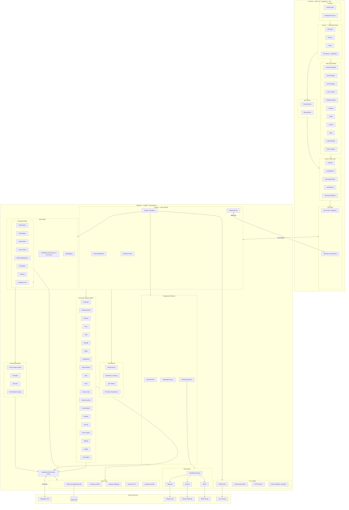
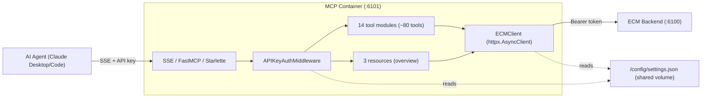

# ECM Architecture

## System Overview


```mermaid
graph TB
    subgraph Frontend["Frontend — React 18 + TypeScript + Vite"]
        direction TB

        subgraph Providers["Providers"]
            AuthProvider
            NotificationProvider
        end

        subgraph AppState["App.tsx — Centralized State"]
            Channels
            Streams
            Filters
            EditMode["Edit Mode + Undo/Redo"]
        end

        subgraph Tabs["Tabs (lazy-loaded)"]
            ChannelManager["Channel Manager"]
            M3UManager["M3U Manager"]
            EPGManager["EPG Manager"]
            AutoCreation["Auto Creation"]
            FFMPEGBuilder["FFMPEG Builder"]
            Settings["Settings"]
            Guide & Journal & Stats
            LogoManager["Logo Manager"]
            M3UChanges["M3U Changes"]
        end

        subgraph Panes["Main Panes"]
            ChannelsPane
            StreamsPane
        end

        subgraph Hooks["Custom Hooks (15)"]
            useAuth & useEditMode & useChangeHistory
            useSelection & useAsyncOperation
        end

        subgraph Services["API Layer"]
            api["api.ts (100+ endpoints)"]
            httpClient["httpClient.ts (fetchJson)"]
        end

        Providers --> AppState
        AppState --> Tabs
        AppState --> Panes
        Tabs --> Hooks
        Panes --> Hooks
        Hooks --> Services
    end

    subgraph Backend["Backend — FastAPI + SQLAlchemy"]
        direction TB

        subgraph MainApp["main.py — App Lifecycle"]
            CORS["CORS Middleware"]
            ReqTiming["Request Timing"]
            WebSocket["WebSocket /ws"]
            Startup["Startup / Shutdown"]
        end

        subgraph Auth["Auth System"]
            AuthRoutes["auth/routes.py"]
            AdminRoutes["auth/admin_routes.py"]
            AuthTokens["JWT Tokens"]
            AuthProviders["Providers (Dispatcharr)"]
        end

        subgraph Routers["20 Domain Routers (/api/*)"]
            direction LR
            R_channels["/channels"]
            R_groups["/channel-groups"]
            R_streams["/streams"]
            R_m3u["/m3u"]
            R_epg["/epg"]
            R_settings["/settings"]
            R_tasks["/tasks"]
            R_notifications["/notifications"]
            R_alerts["/alert-methods"]
            R_tags["/tags"]
            R_stats["/stats"]
            R_streamstats["/stream-stats"]
            R_preview["/stream-preview"]
            R_norm["/normalization"]
            R_profiles["/profiles"]
            R_journal["/journal"]
            R_auto["/auto-creation"]
            R_ffmpeg["/ffmpeg"]
            R_health["/health"]
            R_m3udigest["/m3u-digest"]
        end

        subgraph TaskSystem["Task Engine"]
            TaskEngine["TaskEngine (60s interval, 3 concurrent)"]
            TaskRegistry["TaskRegistry"]
            subgraph Tasks["Scheduled Tasks"]
                M3URefresh & EPGRefresh & StreamProbe
                AutoCreate["Auto Creation"]
                M3UChangeMonitor & M3UDigest
                Cleanup & PopularityCalc["Popularity Calc"]
            end
        end

        subgraph BackgroundServices["Background Services"]
            StreamProber["StreamProber"]
            BandwidthTracker["BandwidthTracker"]
            NotifService["NotificationService"]
        end

        subgraph AlertSystem["Alert System"]
            AlertBase["AlertMethod (base)"]
            Discord & SMTP & Telegram
        end

        subgraph TLS["TLS / ACME"]
            AcmeClient["ACME Client"]
            CertRenewal["Auto-Renewal (24h)"]
            HTTPSServer["HTTPS Server"]
            DNSProviders["DNS (Cloudflare, Route53)"]
        end

        subgraph Engines["Processing Engines"]
            AutoEngine["Auto-Creation Engine"]
            AutoEval["Evaluator"]
            AutoExec["Executor"]
            NormEngine["Normalization Engine"]
        end

        subgraph Data["Data Layer"]
            DB["SQLite (/config/journal.db)"]
            Models["models.py (ORM)"]
            Config["config.py (Settings)"]
            Cache["cache.py (TTL)"]
            JournalLog["journal.py (Audit)"]
        end

        Client["DispatcharrClient (async HTTP)"]

        MainApp --> Auth
        MainApp --> Routers
        Startup --> TaskSystem
        Startup --> BackgroundServices
        Startup --> TLS
        Routers --> Client
        Routers --> Data
        TaskSystem --> Tasks
        Tasks --> Client
        Tasks --> Engines
        BackgroundServices --> Client
        NotifService --> AlertSystem
        AlertBase --> Discord & SMTP & Telegram
        Engines --> Client
        Client --> Data
    end

    subgraph External["External Services"]
        Dispatcharr["Dispatcharr API"]
        SQLiteDB[("SQLite DB")]
        TelegramAPI["Telegram API"]
        DiscordWebhook["Discord Webhook"]
        SMTPServer["SMTP Server"]
        LetsEncrypt["Let's Encrypt"]
    end

    Services <-->|"HTTP/JSON"| MainApp
    WebSocket <-->|"Real-time"| httpClient
    Client <-->|"JWT Auth"| Dispatcharr
    DB --- SQLiteDB
    Telegram --> TelegramAPI
    Discord --> DiscordWebhook
    SMTP --> SMTPServer
    AcmeClient --> LetsEncrypt
```

## Request Flow

```
Browser → Frontend (React SPA on :6100/static/ by default)
       → HTTP/JSON → FastAPI (:6100/api/* by default)
                    → CORS middleware → Auth check → Router endpoint
                    → DispatcharrClient → Dispatcharr API (upstream)
                    → SQLAlchemy ORM → SQLite (/config/journal.db)
       → WebSocket → /ws (real-time status updates)
```

## Background Processing

```
Startup → TaskEngine (checks every 60s, max 3 concurrent)
        → M3U Refresh, EPG Refresh, Stream Probe, Auto-Creation,
          M3U Change Monitor, M3U Digest, Cleanup, Popularity Calc
        → NotificationService → AlertMethods (Discord, SMTP, Telegram)
        → StreamProber (health checks, bitrate sampling)
        → BandwidthTracker (bandwidth stats polling)
        → TLS Renewal (24h check interval)
```

## Key Boundaries

| Boundary | Frontend | Backend |
|-|-|
| State | App.tsx useState (no Redux) | SQLite + in-memory cache |
| Auth | AuthContext + JWT in cookies | JWT validation + session management |
| API | api.ts (100+ named exports) | 20 routers in routers/ |
| Real-time | useStatusWebSocket hook | WebSocket /ws endpoint |
| Config | localStorage (filters, prefs) | /config/settings.json |

---

## Auto-Creation Pipeline Internals

`AutoCreationEngine` orchestrates a per-stream pipeline. For each stream in scope it builds a `StreamContext`, evaluates it against a rule via `ConditionEvaluator`, and on match hands the matched actions to `ActionExecutor`.

```
AutoCreationEngine.run_pipeline() / run_rule()
  ├─ _load_existing_data · _load_rules · _fetch_streams · _load_stream_stats
  ├─ _apply_global_filters
  ├─ _probe_unprobed_streams → _batch_probe_streams          (ffprobe fill-in)
  │
  ├─ _process_streams:                                       [main loop, per stream]
  │    ├─ build StreamContext(stream, existing_data, stats)
  │    ├─▶ ConditionEvaluator.evaluate(StreamContext, rule)
  │    │       └─ returns match? action list?
  │    └─▶ ActionExecutor.execute(Action, ExecutionContext)
  │            ├─ _execute_create_channel   _execute_create_group
  │            ├─ _execute_merge_streams    _execute_assign_logo
  │            ├─ _execute_assign_epg       _execute_assign_tvg_id
  │            ├─ _execute_assign_profile   _execute_assign_channel_profile
  │            ├─ _add_stream_to_channel    _update_channel
  │            ├─ _ensure_channel_m3u_counts _match_epg_data
  │            └─ reload_epg_data           verify_epg_assignments
  │            → returns ActionResult
  │
  ├─ _reorder_channel_streams · _reconcile_orphans · _refresh_dummy_epg_and_retry
  └─ rollback_execution   [on failure — undoes created entities]
```

**Data currency (5 DTOs threaded through the pipeline):**

| DTO | Source | Role |
|-|-|-|
| `StreamContext` | `auto_creation_evaluator.py` | Stream + existing data + stats — input to evaluation |
| `Action` / `ActionType` | `auto_creation_schema.py` | The verb + its parameters |
| `ExecutionContext` | `auto_creation_executor.py` | Per-run rollback tracker |
| `ActionResult` | `auto_creation_executor.py` | Outcome reported back up the chain |

`AutoCreationEngine` has exactly three production collaborators: `ConditionEvaluator`, `ActionExecutor`, and `init_auto_creation_engine`. Everything else in its call graph is tests.

## Normalization ↔ Auto-Creation Coupling

The normalization and auto-creation subsystems are architecturally independent and coupled only via a singleton factory:

```
AutoCreationEngine._process_streams()
    └─ calls get_normalization_engine()         [singleton factory]
            └─ returns NormalizationEngine
                    ├─ normalize()              [public API]
                    ├─ extract_core_name()
                    ├─ test_rule() / test_rules_batch()
                    ├─ get_all_rules() / invalidate_cache()
                    └─ [internals: _load_rules, _match_condition, _match_compound_conditions,
                                    _match_tag_group, _apply_action, _apply_else_action,
                                    _apply_rules_single_pass, _apply_legacy_custom_tags]
```

Auto-creation treats normalization as an opaque service: it obtains the engine via the factory and calls `normalize()`. No shared types, no shared state. The only other production caller of `NormalizationEngine` is `scripts/normalization_canary.py`.

## Frontend Edit-Commit UX Pattern

UI changes are not applied immediately. They're staged in memory, undo/redo-tracked, then flushed to the backend as a single bulk operation:

```
User interaction
  └─ useEditMode              [stages change in memory]
       │
       ├─ useChangeHistory    [undo/redo]
       │
       └─ on commit:
            ├─ api.bulkCommit()              → POST /api/channels/bulk-commit
            ├─ api.bulkMergeChannels()       → POST /api/channels/bulk-merge
            └─ api.bulkAssignChannelNumbers() → POST /api/channels/assign-numbers
                  └─ backend atomically applies N operations
```

Why: the channel list spans 27k+ streams. Per-change network calls would be unusably slow and would prevent the preview-and-commit UX entirely. Staging enables undo/redo, preview diffs, pre-commit validation, and rollback on bulk failure.

**Lazy per-group stream loading** is a related optimization — the 27k streams are never loaded at once. Streams are fetched on demand per channel group as the user navigates.

## MCP Server

A separate container (`mcp-server/`, default port 6101) exposes ECM operations to AI agents via the Model Context Protocol. Runs as a Starlette app with SSE transport; Claude Desktop/Code connect over SSE.


```mermaid
graph LR
    Agent["AI Agent (Claude Desktop/Code)"]

    subgraph MCPContainer["MCP Container (:6101)"]
        Transport["SSE / FastMCP / Starlette"]
        AuthMW["APIKeyAuthMiddleware"]
        Tools["14 tool modules (~80 tools)"]
        Resources["3 resources (overview)"]
        Client["ECMClient (httpx.AsyncClient)"]

        Transport --> AuthMW
        AuthMW --> Tools
        AuthMW --> Resources
        Tools --> Client
        Resources --> Client
    end

    ECMBackend["ECM Backend (:6100)"]
    Settings["/config/settings.json (shared volume)"]

    Agent -->|"SSE + API key"| Transport
    Client -->|"Bearer token"| ECMBackend
    AuthMW -.reads.-> Settings
    Client -.reads.-> Settings
```

**Tool modules (14 domains):** `channels`, `channel_groups`, `streams`, `m3u`, `epg`, `auto_creation`, `export`, `ffmpeg`, `tasks`, `stats`, `system`, `notifications`, `profiles`, `normalization`.

**Resources (read-only):** `ecm://stats/overview`, `ecm://channels/summary`, `ecm://tasks/status`.

**Auth model — two separate keys:**

- **Inbound (MCP client → MCP server):** API key from `settings.json:mcp_api_key`. Accepts `?api_key=` query param or `Authorization: Bearer`. Re-read on every request (no restart for rotation). `/health` is public; `/messages/` is session-bound after the SSE handshake on `/sse`.
- **Outbound (MCP server → ECM backend):** the same key is sent as `Authorization: Bearer` to ECM. `ECMClient` recreates the httpx client on key change.

**Compound tools:** most tools wrap a single ECM endpoint, but some orchestrate multiple calls. Examples:

- `set_logo_from_epg(channel_ids)` — per channel: read channel → read EPG entry → create-or-find logo → PATCH channel.
- `build_channel_lineup(channels, group_id, provider_id, market)` — bulk-create channels via `/bulk-commit`, fetch the created channels, fuzzy-match streams per channel using shared `_score_match` / `_generate_variants` helpers from `tools/streams.py`, then assign matched streams.

**Deployment:** `ECM_URL=http://ecm:6100` (internal Docker network); shares the `/config/` volume with the ECM backend for the API key file. The key is generated in ECM's UI under *Settings → MCP Integration*.

## External API Contract — Dispatcharr

`backend/dispatcharr_client.py` makes **73 named calls** into Dispatcharr's HTTP API, covering **4 of Dispatcharr's 13 Django apps**. The table below maps each ECM domain to the Dispatcharr app that serves it.

| Dispatcharr app | ECM calls | Method count |
|-|-|-|
| `apps/channels/` | channels, channel groups, channel profiles, streams, stream groups, stream profiles, profile channels, logos, server groups | 34 |
| `apps/m3u/` | M3U accounts, M3U profiles, M3U filters, M3U group settings, refresh | 20 |
| `apps/epg/` | EPG sources, EPG data, EPG grid, trigger import | 10 |
| `apps/accounts/` + proxy runtime | `get_users`, `stop_channel`, `stop_client`, `get_system_events` | 4 |
| *Not used by ECM* | `hdhr`, `vod`, `backups`, `plugins`, `dashboard`, `output`, `connect` (core) | 0 |

All 73 calls funnel through `DispatcharrClient._request()`, which handles the JWT-or-API-key auth lifecycle (`_login`, `_refresh_access_token`, `_ensure_authenticated`).

**Contract symmetry check (cross-repo graph):** 47 of 73 ECM client methods have direct camelCase counterparts in Dispatcharr's own frontend (`frontend/src/api.js`). The remaining 26 are mostly CRUD operations on DRF `ModelViewSet`s (Django REST Framework auto-generates list/retrieve/create/update/destroy endpoints without explicit function definitions, so there's nothing for a graph to match against) plus a handful of specialized M3U refresh and EPG import triggers. The two clients being parallel is strong evidence that the API contract is stable.

**Drift candidates (watch these for breakage in Dispatcharr releases):** `get_all_m3u_group_settings`, `update_m3u_group_settings`, `get_epg_grid`, `trigger_epg_import`, `refresh_m3u_vod`, `find_logo_by_url`, `bulk_update_profile_channels`. These don't have direct frontend equivalents in Dispatcharr, so they may be ECM-specific uses of backend endpoints the UI doesn't exercise — more likely to break silently.

**Upstream schema source:** `http://<dispatcharr-host>:9191/swagger.json` (YAML format despite the name). See `docs/dispatcharr_api.md` for the fetch pattern and known endpoint conventions.
