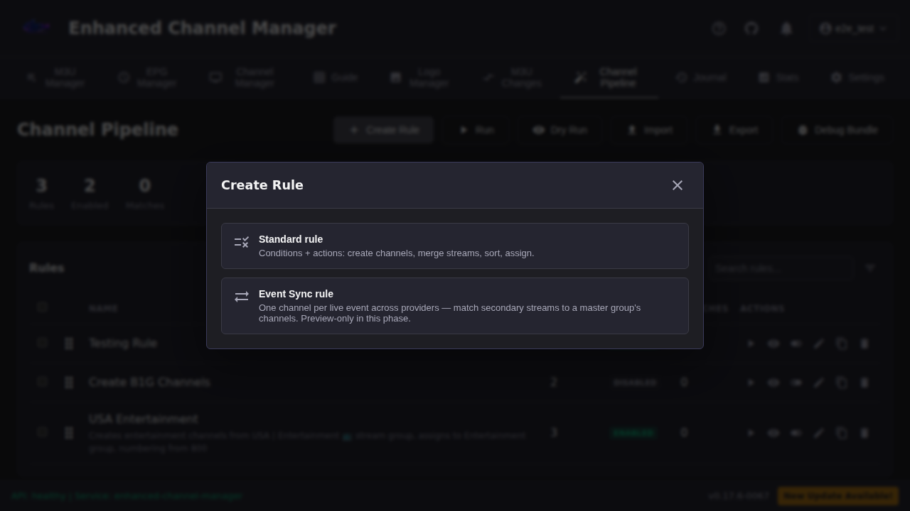
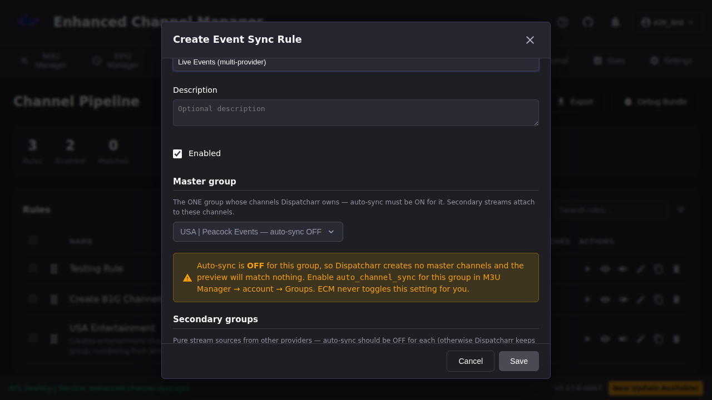
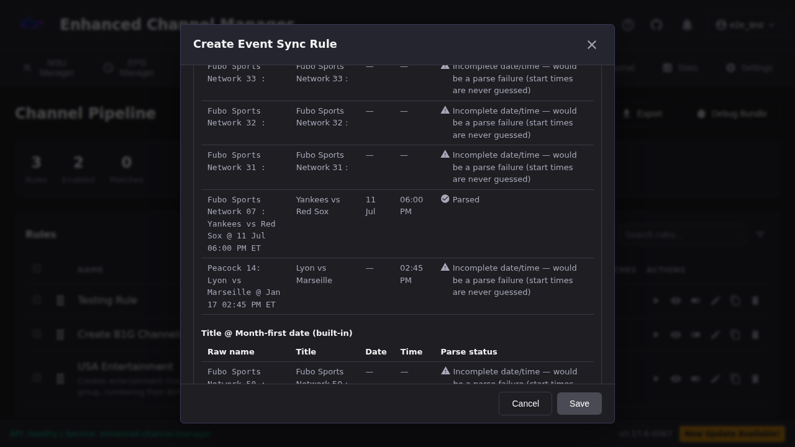
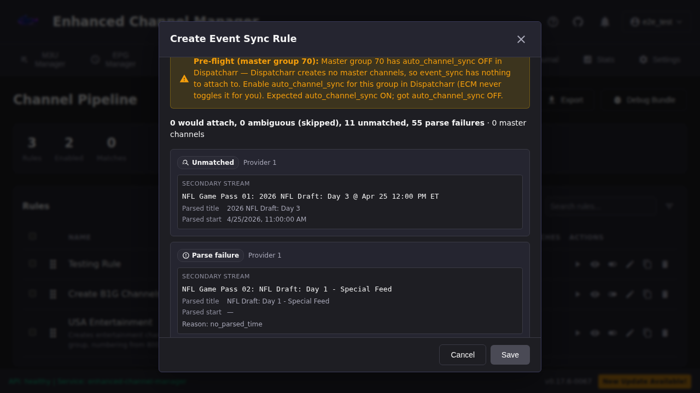
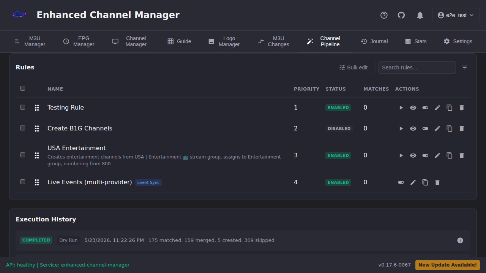
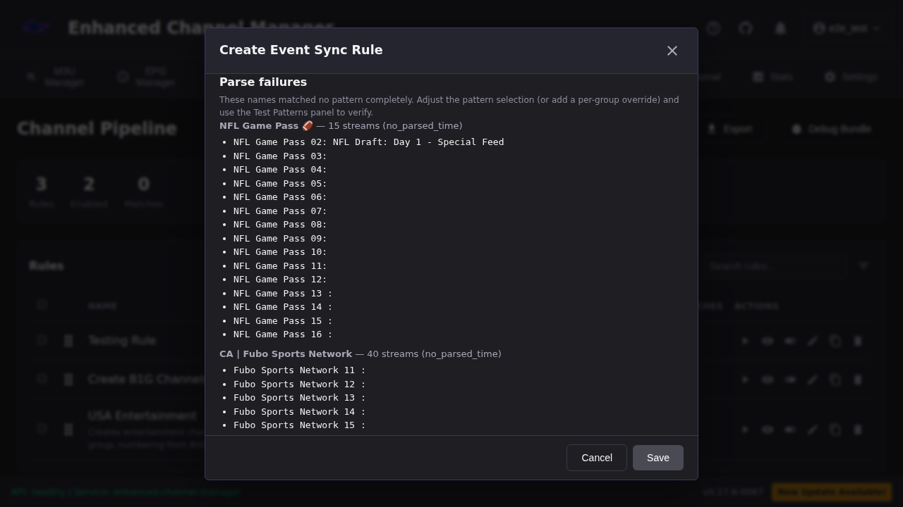
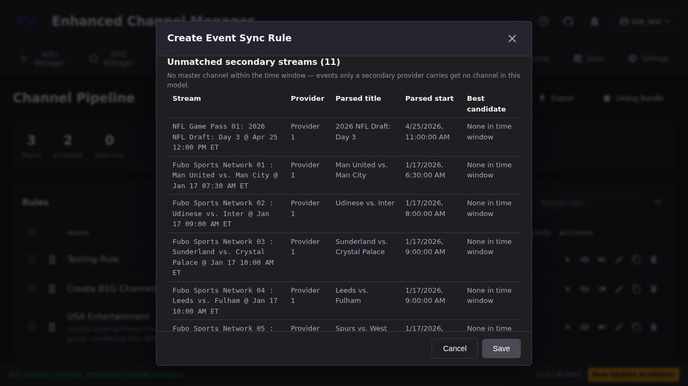

# Event Sync

> One channel per live event across providers. This guide is dual-audience:
> the first half is for operators consolidating provider event groups; the
> [Developer reference](#developer-reference) at the bottom is for engineers
> working on the matcher, resolver, or schema.

> **Phase status: preview-only (Phase 1A).** event_sync rules are excluded
> from pipeline execution entirely — there is no attach path yet. Everything
> below the Quick start describes the preview surface. The attach path
> (Phase 1B) ships only after match quality is validated on real provider
> data (epic `enhancedchannelmanager-ti939`).

## Overview

Operators with multiple IPTV providers get N duplicate channels per
sports/PPV event — one per provider's auto-sync event group — because the
same real-world event is named differently by every provider (slot
prefixes, team abbreviations, date formats). Event Sync collapses those N
channels down to one.

The model: designate **one** provider's event group as the **master**
group. Dispatcharr's `auto_channel_sync` stays **ON** for it, and
Dispatcharr owns the full channel lifecycle (create/update/delete) from
that group, exactly as it does today. Every other provider's event group
is a **secondary**: `auto_channel_sync` **OFF**, a pure stream source.
ECM matches each secondary stream to a master channel — parse the name to
(event title, start time), block by time window, fuzzy-score the parsed
titles, cross-check team tokens — and, in a later phase, attaches the
matched stream to that master channel (failover + quality choice on one
channel number). **ECM never creates or deletes channels in this
feature** — Dispatcharr does, from the master group only.

## Quick start — Consolidate event groups across providers

This walkthrough takes one live-events use case (say, three IPTV providers
that each publish a "Sports"/"Events" group with the same fixtures) from
raw duplicate channels to a working preview.

### 1. Pick the master group

Pick the provider whose event group is broadest and most reliable —
usually the one with the most complete fixture list and the most
consistent naming. Its Dispatcharr `auto_channel_sync` should already be
ON (leave it ON; that's what makes it eligible as a master). This group's
channels are the ones every other provider's stream will attach to, so
picking the group with the best coverage minimizes how many events end up
in the [unmatched list](#events-missing-entirely-master-as-ceiling).

### 2. Turn secondary auto-sync OFF (manual, this phase)

For **every other** provider's event group, disable `auto_channel_sync` in
Dispatcharr (M3U Manager → account → Groups). This is a manual step in
Phase 1A — ECM never toggles Dispatcharr settings for you, and the rule
editor's live status only *reports* the setting, it doesn't change it. If
you skip this, Dispatcharr keeps creating its own channels from the
secondary group and you're back to duplicates regardless of what ECM
matches — see [the auto-sync gotcha](#still-seeing-duplicate-channels)
below.

### 3. Create the Event Sync rule

Channel Pipeline tab → **Create Rule**. Pick **Event Sync rule** from the
kind chooser (not Standard rule — Event Sync rules carry a JSON config
instead of conditions/actions and never run in a Standard rule's engine
path):



### 4. Configure master + secondary groups

Name the rule, then pick the master group and the secondary group(s) from
the dropdowns. The editor shows **live** auto-sync status per group and
warns immediately if the master is OFF or a secondary is still ON:



Fix any warning here before moving on — the same checks re-run as
[pre-flight](#pre-flight-checks) on every preview.

### 5. Keep the shipped default pattern

The **Parse patterns** section ships with the two built-in patterns
pre-selected (`slot-title-day-first-date`, `slot-title-month-first-date`).
These cover the most common live-stream shape — optional two-digit slot
prefix, title, `@ <date> <time>` — and most rules never need a custom
regex. See the [pattern cookbook](#pattern-cookbook) below if your
provider's names don't fit.

### 6. Use Test Patterns

Before trusting a pattern selection, expand **Test patterns against sample
names**, paste (or fetch live) sample stream names from your groups, and
run the test. It shows exactly what title / date / time each pattern
extracts per name, using the *same* server-side extraction machinery the
matcher uses at preview time — so a green row here is a green row in the
preview, not a guess:



A row flagged **Incomplete date/time** means Event Sync will never guess
that name's start time — it will show up as a `parse_failed` stream in
the preview, not a mismatch. That's expected for placeholder/filler slots
that haven't been assigned an event yet.

### 7. Read the Preview

Click **Preview matches**. The response is a zero-write dry run against
live Dispatcharr data:



Read it top to bottom:

- **Pre-flight banner** (if present) — a misconfigured group, shown loudly
  rather than silently producing an empty result. Fix it, don't ignore it.
- **Summary line** — `would_attach` / `ambiguous (skipped)` / `unmatched`
  / `parse_failed` counts that always sum to the total secondary stream
  count, plus the master channel count.
- **Match cards** — one per secondary stream, with its disposition badge,
  parsed title/start, and (for `would_attach`) the master channel it
  would attach to plus every scored candidate in a table (score, band,
  team-token verdict, time delta, reject reason).
- **Unmatched secondary streams** and **Parse failures** — see
  [Troubleshooting](#troubleshooting) below.

If the counts and match cards look right, **Save** the rule. There is
deliberately no "Apply" or "Attach" button anywhere in this phase — saving
only stores the config; Preview is the only action that touches live data,
and it never writes.

Saved Event Sync rules carry a badge in the rule list and are excluded
from **Run** / **Dry Run** — they have no execution path yet:



## Pattern cookbook

The two built-in patterns cover the majority of live-stream naming shapes
observed across providers. Below are three verified provider name shapes
and the pattern that parses each — copy-paste consistent with the shipped
patterns in `frontend/src/components/channelPipeline/eventSyncShippedPatterns.json`
and the matcher defaults in `backend/services/event_sync_matcher.py`
(every regex below was run against its example through the real
`parse_event_name()` while writing this guide).

### 1. Slot-prefixed, month-first date, with "@" (built-in)

```
Fubo Sports Network 07 : Chelsea vs. Brentford @ Jan 17 10:00 AM ET
```

Parses to title `Chelsea vs. Brentford`, start `Jan 17 10:00 AM ET`. This
is the **`slot-title-month-first-date`** built-in — no configuration
needed, it's pre-selected by default.

```
title_pattern: ^(?:[^@:]{0,40}?(?<!\d)\d{2}\s*:\s*)?\s*(?P<title>.+?)\s*(?:@\s*(?:\d{1,2}\s+[A-Za-z]{3,9}\s+\d{1,2}:\d{2}|[A-Za-z]{3,9}\.?\s+\d{1,2}(?:\s*,?\s*\d{4})?\s+\d{1,2}:\d{2}).*)?$
time_pattern:  (?P<hour>\d{1,2}):(?P<minute>\d{2})(?:\s*(?P<ampm>[AaPp])\.?[Mm]?\.?)?\s*(?:E[SD]?T)?\s*$
date_pattern:  @\s*(?P<month>[A-Za-z]{3,9})\.?\s+(?P<day>\d{1,2})(?:\s*,?\s*(?P<year>\d{4}))?\s+\d{1,2}:\d{2}
```

### 2. Slot-prefixed, day-first date, with "@" (built-in)

```
Peacock 14: Mercury vs. Aces @ 11 Jul 06:00 PM ET
```

Parses to title `Mercury vs. Aces`, start `11 Jul 06:00 PM ET`. This is
the **`slot-title-day-first-date`** built-in — also pre-selected by
default; the two built-ins run in order and the first complete match
wins, so most rules can leave both on and cover both date shapes without
any per-provider configuration.

```
title_pattern: ^(?:[^@:]{0,40}?(?<!\d)\d{2}\s*:\s*)?\s*(?P<title>.+?)\s*(?:@\s*(?:\d{1,2}\s+[A-Za-z]{3,9}\s+\d{1,2}:\d{2}|[A-Za-z]{3,9}\.?\s+\d{1,2}(?:\s*,?\s*\d{4})?\s+\d{1,2}:\d{2}).*)?$
time_pattern:  (?P<hour>\d{1,2}):(?P<minute>\d{2})(?:\s*(?P<ampm>[AaPp])\.?[Mm]?\.?)?\s*(?:E[SD]?T)?\s*$
date_pattern:  @\s*(?P<day>\d{1,2})\s+(?P<month>[A-Za-z]{3,9})\s+\d{1,2}:\d{2}
```

### 3. Slot-prefixed, no "@" separator (shipped, not pre-selected)

Some providers drop the "@" between title and date entirely:

```
NHL Center Ice 03: Rangers vs Islanders 24 Jan 07:00 PM ET
NHL Center Ice 03: Rangers vs Islanders Jan 24 07:00 PM ET
```

Both parse to title `Rangers vs Islanders`, start `24 Jan 07:00 PM ET` /
`Jan 24 07:00 PM ET` respectively. These are shipped as
**`title-day-first-date-no-at`** / **`title-month-first-date-no-at`** in
the pattern picker — check the box for whichever date order your
provider uses (or both). They are not selected by default because the
"@"-based patterns are the common case and an unnecessary extra pattern
only adds a small amount of matching work per name.

```
title_pattern (day-first): ^(?:[^@:]{0,40}?(?<!\d)\d{2}\s*:\s*(?!\d))?\s*(?P<title>.+?)\s*(?:(?:@\s*)?(?:\d{1,2}\s+[A-Za-z]{3,9}\s+\d{1,2}:\d{2}|[A-Za-z]{3,9}\.?\s+\d{1,2}(?:\s*,?\s*\d{4})?\s+\d{1,2}:\d{2}).*)?$
date_pattern (day-first):  (?P<day>\d{1,2})\s+(?P<month>[A-Za-z]{3,9})\s+\d{1,2}:\d{2}
```

(time_pattern is the same on all four shipped patterns.) If your
provider's shape doesn't match any of the four, add a custom shared
pattern (or a per-group override) in the rule editor's **Advanced**
section and verify it with Test Patterns before saving — do not guess.

## Rule configuration (`event_sync_config`)

An auto-creation rule becomes an event_sync rule by carrying an
`event_sync_config` JSON object. Everything else about the rule
(conditions, actions, sorting) is ignored for this kind — the config IS
the rule.

```json
{
  "master_group_id": 12,
  "secondary_group_ids": [34, 56],
  "patterns": [
    {
      "name": "my-provider-shape",
      "title_pattern": "^(?P<title>.+?)\\s*@",
      "time_pattern": "(?P<hour>\\d{1,2}):(?P<minute>\\d{2})(?:\\s*(?P<ampm>[AaPp])\\.?[Mm]?\\.?)?\\s*(?:E[SD]?T)?\\s*$",
      "date_pattern": "@\\s*(?P<day>\\d{1,2})\\s+(?P<month>[A-Za-z]{3,9})"
    }
  ],
  "group_patterns": {
    "34": [ { "title_pattern": "..." } ]
  },
  "time_window_minutes": 30,
  "attach_threshold": 0.80,
  "enabled": true
}
```

| Field | Required | Meaning |
|-|-|-|
| `master_group_id` | yes | The ONE Dispatcharr group whose channels Dispatcharr owns (`auto_channel_sync` ON). Positive integer group ID. |
| `secondary_group_ids` | yes, non-empty | The secondary event groups (`auto_channel_sync` OFF) whose streams get matched onto master channels. Must NOT contain `master_group_id`. |
| `patterns` | no | Shared parse-pattern variants (title/time/date regexes with named capture groups, same shape as the built-in defaults in `backend/services/event_sync_matcher.py`). Omit to use the built-in defaults. |
| `group_patterns` | no | Per-group pattern overrides, keyed by group ID (master or a secondary). A group with an override uses ONLY its own patterns for parsing; other groups keep the shared `patterns` selection. |
| `time_window_minutes` | no (default 30) | Parsed start times must be within ± this window to become candidate pairs. Capped at 1440 (24 hours). |
| `attach_threshold` | no (default 0.80) | Auto-attach score floor on the parsed-title score. **Hard-clamped ≥ 0.80** — it can be raised per rule, never lowered. |
| `enabled` | no (default true) | Feature toggle within the rule. |

### Why validation is strict

Validation errors are designed to teach — each carries the field, the
value you sent, what was expected, and a link back to this document.

* **Mandatory scoping** (`master_group_id` present, `secondary_group_ids`
  non-empty, master not in secondaries) is schema-enforced, not
  convention. It is the rail that prevents recurrence of the prior
  fuzzy-matching incident — see [History: the 1,341-incident
  benchmark](#history-the-1341-incident-benchmark) below.
* **Parse regexes compile through `safe_regex` at save time.** Operator
  regex is the ReDoS surface; the save-time compiler is the exact one the
  runtime uses.
* **The 0.80 attach floor is hard-clamped twice** — rejected below the
  floor at save time, and clamped again at runtime by the matcher's
  admission policy (`EVENT_ATTACH_FLOOR` in
  `backend/services/event_sync_matcher.py`, the single source of truth).
  See [Threshold and bands](#threshold-and-bands) for why 0.80.
* **`time_window_minutes` is capped at 1440 (24 hours).** The time window
  is the rail that keeps same-teams-different-day fixtures apart — an
  oversized window re-opens that false-positive class, and the frozen
  regression corpus only proves the matcher's precision at sane windows.
* **Unknown keys are rejected**, so a typo'd optional key cannot silently
  fall back to its default.

## Threshold and bands

Every candidate pair — one secondary stream against one master channel
within the time window — lands in exactly one confidence band:

| Band | Score range | What happens |
|-|-|-|
| **attach** | `score ≥` effective threshold (see below) | Best candidate becomes the stream's `would_attach_master` (Phase 1B will attach it; Phase 1A only reports it). |
| **ambiguous** | `0.60 ≤ score <` effective threshold | Surfaced for operator review in the preview. **Never auto-attached**, at any score. |
| **reject** | `score < 0.60`, or a hard-reject rail fired | Never attached. In-window rejected pairs still appear in the preview's candidates table with a machine-readable reject reason (`team_token_conflict`, `numeric_identity_conflict`, `no_parsed_time`, `parse_failure`, `below_ambiguous_floor`); out-of-window pairs (`outside_time_window`) are excluded from candidacy entirely. |

The "effective threshold" is not always 0.80: without positive team-token
agreement (the team-token check found no team pair on one side, or the
pairs were inconclusive), the bar rises to 0.90 — lexical overlap alone
has to clear a higher bar than lexical overlap corroborated by matching
team names. A team-token *conflict* is a hard reject regardless of score.

**Why the floor is 0.80 and can only go up, never down**: 0.80 is the
calibrated default the PO set for this feature. The schema rejects any
per-rule threshold below 0.80 with a teaching error at save/preview time,
and the matcher's runtime admission policy additionally clamps — so even
a stored legacy value below the floor behaves as 0.80. This mirrors the
philosophy behind the M1 callsign hard-reject rail elsewhere in the
pipeline: precision over recall everywhere, because of what a wrong
attach costs:

Wrong attachments are reversible and non-compounding, but not self-healing — the matcher is deterministic, so a bad match repeats every run until you adjust a pattern or threshold, or the provider renames the stream.

In other words: a bad match doesn't get worse over time (it isn't
compounding — it doesn't cascade into more bad matches), and detaching a
wrongly-attached stream is a normal, low-risk operation. But it also
won't fix itself. If a stream mis-attaches, expect it to mis-attach the
same way every subsequent preview/run until you either raise the
threshold, tighten/fix the pattern that's producing the wrong parsed
title, or the provider changes the name (which is out of your control).
Budget for periodically re-checking the preview after a provider renames
its slots.

## Troubleshooting

### Still seeing duplicate channels?

**A secondary group still has `auto_channel_sync` ON.** This is, by a
wide margin, the most common cause. Event Sync only *attaches streams* to
master channels — it never stops Dispatcharr from creating its own
channels from a secondary group whose auto-sync is still on. If a
secondary is still ON, Dispatcharr keeps creating a parallel set of
channels from that group regardless of what ECM matches, and you'll see
both the master's channel *and* the secondary's own auto-created
duplicate.

Fix: M3U Manager → account → Groups → disable `auto_channel_sync` for
every group used as a `secondary_group_ids` entry. ECM never toggles this
setting for you — it only reports the current state (rule editor's live
warnings, and the [pre-flight check](#pre-flight-checks) on every
preview).

### Nothing matches

1. Check the **pre-flight** result at the top of the preview. If the
   master group's `auto_channel_sync` is OFF, Dispatcharr has created no
   master channels — there is nothing to match against, and every stream
   will show as `unmatched` even though the matcher itself is working
   correctly.
2. Check the **parse failures** panel. If most or all of your secondary
   streams show up there, your parse pattern isn't matching that
   provider's name shape at all — see the [pattern
   cookbook](#pattern-cookbook) and verify with [Test
   Patterns](#6-use-test-patterns) before assuming the matcher is broken:

   

### Events missing entirely (master-as-ceiling)

If a real event never shows up as a channel at all — not even
`unmatched` — check whether it's carried **only** by a secondary
provider and not by the master. This is the accepted "master-as-ceiling"
limitation of the current model: **events carried only by secondary
providers get no channel**, because ECM never creates channels — only
Dispatcharr does, from the master group. Every preview reports these
streams explicitly in the **unmatched secondary streams** list so you
have visibility into how much coverage you're losing:



If this list is large and consistently the same events, it's evidence for
picking a different (broader) master group, or a future promotion feature
(tracked under epic `enhancedchannelmanager-ti939.4`, not built yet) — not
something to work around today.

## Pre-flight checks

Before a preview (and later, a run), ECM verifies against Dispatcharr —
read-only, ECM never toggles group settings:

* master group has `auto_channel_sync` **ON** (otherwise no master
  channels exist and the whole feature silently matches nothing);
* every secondary group has `auto_channel_sync` **OFF** (otherwise
  Dispatcharr is creating duplicate channels from a stream-source group);
* every configured group still exists in some account's group settings.

Failures surface in the preview/run results with the expected/actual
setting and which group failed — they never silently block the preview;
you always see the match results alongside the misconfiguration.

**Known edge**: Dispatcharr channel groups are global **by name**
(bd-dgs64). If a secondary provider publishes a group with the SAME name
as another account's auto-synced group, they share a group ID, and the
pre-flight secondary check will fail for it (correctly — Dispatcharr is
auto-syncing that group ID). Real event groups are provider-distinct-named
in practice.

## What ECM deliberately does NOT do

* **No channel lifecycle.** Dispatcharr creates, updates and deletes the
  master channels (verified: its sync task updates in place, preserves
  channel UUIDs, never resets a channel's stream list, and deletes a
  channel only when the master provider drops the stream — the cascade
  detaches secondary streams cleanly).
* **No orphan reconciliation.** event_sync rules never populate
  `managed_channel_ids` and hard-bypass the pipeline's Pass 4 orphan
  cleanup — reconciling channels ECM doesn't own would delete or move
  Dispatcharr-owned channels. See [Pass 4 orphan
  bypass](#pass-4-orphan-bypass) below.
* **No persisted channel IDs.** Matching is recomputed statelessly every
  run; master channels are the identity anchor. See [No durable cluster
  state](#no-durable-cluster-state) below.
* **No auto-run.** Manual-run-only until Phase 2's explicit opt-in flag.

## Previewing matches (Phase 1A)

`POST /api/channel-pipeline/event-sync-preview` runs the full matcher
against live Dispatcharr data with **zero writes** — per-stream match rows
(score, band, team-token verdict, time delta, reject reason), unmatched
streams, parse failures grouped by group, and summary counts that
reconcile exactly with the detail rows. It accepts either a saved rule id
or an inline `event_sync_config` (so the rule editor can preview before
saving). Full request/response contract: [`docs/api.md`](api.md). Headless
mirror: the `preview_event_sync` MCP tool. The preview and the future
attach path share one resolver (`backend/services/event_sync_resolver.py`),
so what the preview shows is what Phase 1B would do — dry-run parity by
construction.

## Developer reference

### Matcher layering

`backend/services/event_sync_matcher.py` scores a candidate pair through
four ordered layers, each existing to reject a specific failure mode the
earlier layers can't catch on their own:

1. **Parse** (`parse_event_name`) — turn a raw provider string into
   `(title, start_datetime, teams)`, reusing the dummy-EPG
   `extract_groups` / `compute_event_times` machinery so operator-authored
   pattern overrides go through the same `safe_regex` path as any other
   untrusted regex in this codebase. A name with no COMPLETE parsed
   date+time is unmatchable by contract — the start time is **never**
   guessed from "now" the way dummy-EPG's filler-programming fallback
   does. This exists because the whole model depends on the parsed start
   time being trustworthy; a guessed time would silently corrupt the next
   layer.
2. **Time-window blocking** — candidate *generation*, not a safety rail:
   only pairs whose parsed start times are within ± `time_window_minutes`
   (default 30, capped at 1440) become candidates at all. This exists
   both for correctness (a Tuesday 7pm game and a Thursday 7pm game
   between the same two teams are different fixtures — same-teams,
   different-day is exactly the false-positive shape a title-only fuzzy
   match would miss) and for performance (it bounds the N×M pair count
   before the more expensive fuzzy scoring runs).
3. **Fuzzy score of PARSED titles** (never raw names) — RapidFuzz
   `token_set_ratio` on LOCALS-cleaned strings via the shared cleaner in
   `services/dedup_matcher.py`. Scoring the *parsed* title rather than the
   raw stream name is what makes "Peacock 14: Mercury vs. Aces @ ..." and
   "FS2 05: Phoenix Mercury vs. Las Vegas Aces @ ..." score high — slot
   prefixes and date/time suffixes are already stripped before this layer
   ever runs.
4. **Team-token check** — split the title on `vs` / `vs.` / `v.` / `@`,
   compare the two sides order-insensitively (including qualifier classes
   like `W`/`Women`/`U21`/`Reserves`, and abbreviation/initialism forms
   like `MUFC` ↔ `Manchester United`). A CONFLICT (both sides parse to
   team pairs and clearly differ) is a HARD REJECT — score forced to 0.0
   — mirroring the M1 callsign hard-reject rail elsewhere in the
   pipeline. Token AGREEMENT raises confidence enough to admit even a
   lexically-distant abbreviation on its own. This layer exists because
   fuzzy title scoring alone is fooled by sibling-program pairs (e.g. two
   different studio shows sharing most of their surrounding words) that
   score high on lexical overlap without denoting the same event.

Layer 5, the **event admission policy** (`is_event_attachable`), is
covered next.

### Event admission policy — structurally separate from the callsign policy

The event admission policy (`is_event_attachable`, gated by its own
`EVENT_ATTACH_FLOOR` constant) is a **deliberately separate** branch from
`services.dedup_matcher`'s callsign-based admission policy used elsewhere
in the pipeline (`merge_streams` / fuzzy dedup). They must never share one
knob, even though they're philosophically parallel (both have a
"no-corroborating-signal" floor that's stricter than the base floor).

#### History: the 1,341-incident benchmark

The reason this separation is schema-mandatory rather than a convention
engineers are trusted to follow: a **prior incident produced 1,341
false-POSITIVE merges** from an unscoped fuzzy-matching rule — streams
that should never have been considered candidates for each other got
merged because the rule had no scoping boundary to stop it. That incident
is the trust benchmark this whole feature is built against:
`master_group_id` / `secondary_group_ids` scoping is schema-enforced (an
unscoped event rule is refused at save time, not caught in review), and
team-token conflict is a hard reject (score 0.0, never admissible at any
fuzzy score) rather than a soft penalty. Precision over recall everywhere
in this module.

### No durable cluster state

Event Sync persists **no new database tables** for match state. The only
durable state is the nullable `event_sync_config` JSON column on
`auto_creation_rules` (the rule's own configuration) plus journal
provenance rows once the attach path ships. Every preview (and, later,
every run) **recomputes matching from scratch** against live Dispatcharr
data — master channels are identified by **name**, never by ID, and the
matcher/resolver modules never see, cache, or return a channel ID.

This is a direct consequence of verified Dispatcharr behavior (read from
Dispatcharr's `apps/m3u/tasks.py` `sync_auto_channels`):

* Channel UUIDs are preserved across refreshes — Dispatcharr does in-place
  updates, not recreate-on-refresh.
* The sync task builds its channel map from the master account's streams
  only, and has no code path that resets a channel's existing stream
  list — a foreign (ECM-attached) stream survives a Dispatcharr refresh.
* A channel is deleted only when the master provider drops the stream
  (the event ended); the cascade detaches secondary streams cleanly.

Because attachments persist across refreshes on Dispatcharr's side, ECM
doesn't need to remember what it attached — it just needs to re-resolve
names to current channel IDs on every run. **Never key state on channel
IDs or stream IDs** — they're Dispatcharr's to reassign, not ECM's to
assume stable.

### Pass 4 orphan bypass

The Channel Pipeline's Pass 4 orphan reconciliation walks
`managed_channel_ids` on a rule and deletes/reassigns channels the rule no
longer claims. event_sync rules **never populate `managed_channel_ids`**
and are **hard-bypassed** from Pass 4 — not merely "produce an empty
list," but structurally excluded from that pass running against them at
all. Running orphan reconciliation against an event_sync rule would treat
Dispatcharr-owned master channels as ECM-managed and could delete or move
channels ECM has no authority over. This bypass is a direct consequence
of the "ECM never creates or deletes channels in this feature" contract —
Pass 4 exists to clean up after channel-creating rules, and event_sync
rules don't create channels.

### Future-state constraint

Any future state that must survive a Dispatcharr refresh — Phase 2 review
decisions, Phase 3 exclusion lists, anything an operator would expect to
persist — **must key on content fingerprints / event identity** (parsed
title + start time, or similar), **never on channel/stream IDs**. This
constraint exists because of the same stateless-recompute reasoning above:
IDs are Dispatcharr's, names/content are the stable identity anchor this
feature can actually reason about across runs.

### Frozen regression corpus — add-only policy

`backend/tests/fixtures/event_sync/matcher_corpus.jsonl` is a **frozen,
append-only** set of labeled real/engineered event-name pairs
(`same_event` / `not_same` / `ambiguous`) that gates the matcher's
precision/recall in CI (`backend/tests/test_event_sync_matcher_corpus.py`).
Every `not_same` pair must land in the `reject` band — a `not_same` pair
that reaches `attach` is an incident-class false positive and fails the
build.

**Add-only, never edit**: add one pair for every matcher bug ever found
(with the bug's bead ID in the pair's `reason` field); never delete or
relabel an existing pair just to make the gate pass. If a matcher change
flips an existing pair's band, that's the gate doing its job — the
change needs to be justified in review or the matcher needs to be fixed,
not the corpus edited to match the new (possibly wrong) behavior. This is
the same trust-but-verify posture as the 1,341-incident history above:
the corpus is the evidence base that a future change hasn't quietly
reopened a previously-fixed false-positive class.

### Explicitly NOT written (home-lab tier)

Consistent with this project's effective deployment tier: no ADR file for
this feature (the rationale lives in this document plus code comments),
no versioned API reference beyond the `event-sync-preview` entry in
[`docs/api.md`](api.md), no dedicated performance guide.

## Related

- [`docs/api.md`](api.md) — full `POST /api/channel-pipeline/event-sync-preview` request/response contract.
- [`docs/architecture.md`](architecture.md) — Channel Pipeline internals and how event_sync rules fit alongside standard rules.
- `backend/services/event_sync_matcher.py` — the matcher (parse → block → score → admit).
- `backend/services/event_sync_resolver.py` — the shared preview/attach resolution layer.
- `backend/services/event_sync_preflight.py` — the read-only Dispatcharr group-settings check.
- `backend/channel_pipeline_schema.py` `validate_event_sync_config` — the config validator (single source of truth for defaults/clamps, imported from the matcher).
- `backend/tests/fixtures/event_sync/matcher_corpus.jsonl` — the frozen regression corpus.
- `frontend/src/components/channelPipeline/eventSyncShippedPatterns.json` — the shipped pattern definitions consumed by both the frontend picker and a backend test that pins each pattern's example against the real parser.
- Epic `enhancedchannelmanager-ti939` — Event Sync overall (Phase 1A preview-only, Phase 1B attach, Phase 2 automation, Phase 3 evidence-driven promotion).
