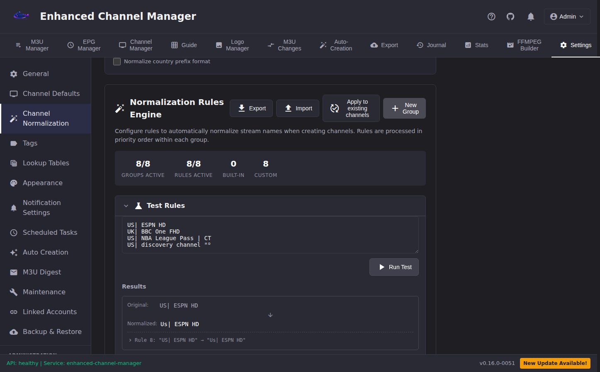
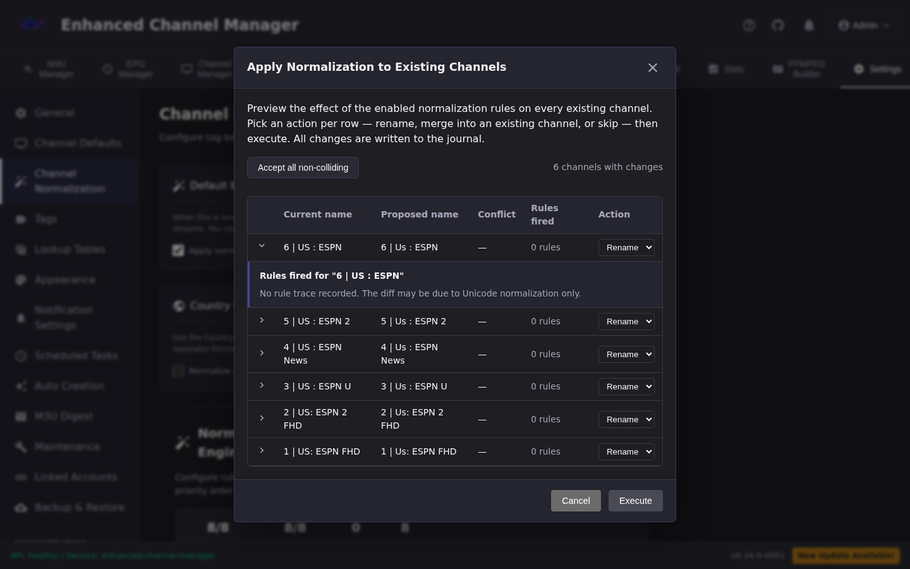

# Normalization

> How ECM collapses noisy stream names into the channel names you want — across Test Rules (the preview you try before saving) and Auto Create (the engine that actually makes channels). This guide is dual-audience: the first half is for operators authoring rules; the [Developer reference](#developer-reference) at the bottom is for engineers integrating with the engine.

## Overview

Normalization is the step between "raw name from an M3U line" and "channel name on disk." It runs in three places:

- **Test Rules** — Settings → Normalization → the preview panel where you paste a sample name and see what the current rule set produces. Safe to use freely; no side effects.
- **Auto Create** — the auto-creation pipeline reads the stream's raw name, passes it through the same rule set, and uses the output as the channel name (or as the lookup key for matching an existing channel).
- **Re-normalize Existing Channels** — a one-time bulk rewrite that reapplies the current rule set to channels already on disk. Manual, gated, undoable.

These three paths **must produce the same output for the same input**. That is the *parity contract*, added in bd-eio04.1 and enforced by a nightly canary ([SLO-5 in `docs/sre/slos.md`](sre/slos.md#slo-5-normalization-correctness)). If a user reports "Test Rules says one thing and my auto-created channel got a different name," that is a canary-level bug — follow [the divergence runbook](runbooks/normalization-canary-divergence.md), don't work around it with a rule change.

### When does normalization run?

- **Test Rules**: on demand, when you click "Test" in the rules UI or call `POST /api/normalization/test` / `test-batch`.
- **Auto Create**: on every stream name processed by an auto-creation rule that has a normalization group configured. If no group is configured on the rule, normalization is **skipped** — `ecm_auto_creation_channels_created_total{normalized="skipped"}` increments.
- **Re-normalize Existing Channels**: only when an operator explicitly runs it via the Settings UI or `POST /api/normalization/apply-to-channels`. Never automatic.

### What normalization is not

- It is not search. `GET /api/channels?search=foo` does its own matching without invoking the normalization rule set.
- It is not EPG matching. EPG match uses channel name + TVG-ID against EPG data; normalization affects the channel name that feeds into EPG match but is not itself EPG logic.
- It is not a regex sandbox. Regex rules run under `safe_regex` (100 ms timeout, bounded pattern size); pathological patterns fail fast with `[SAFE_REGEX]` WARN in logs and are rejected at save time by the linter.

## Quick start

### Your first rule

1. Open **Settings → Normalization Rules**.
2. Pick a rule group (or create one — groups are ordering buckets; rules within a group run in priority order, groups run in group-priority order).
3. Click **Add rule**. Choose a condition and an action.
4. Expand the **Test Rules** panel above the rule groups, paste a sample raw name (one per line), and click **Run Test**.
5. Review the output. If it matches your intent, **Save**. If not, iterate on the rule before saving — you don't pay for retries on the preview path.



### Testing a rule before you commit

Test Rules is the single source of truth for "what will Auto Create do with this input." If Test Rules shows the output you want, Auto Create will produce that same output. If it does not, **do not** work around the rule — file a bug, because divergence between the two paths is the exact failure class the parity contract and SLO-5 canary exist to catch.

- `POST /api/normalization/test` — single rule, single input. Useful when authoring one rule at a time.
- `POST /api/normalization/test-batch` — all enabled rules, multiple inputs. Use this to preview a batch (e.g., pasting 50 raw names from a new M3U).

## Concepts

### Rule groups and ordering

Rules live in groups. Groups run in **group priority** order (lowest number first). Within a group, rules run in **rule priority** order (lowest first). A rule's output feeds into the next rule's input — it's a pipeline, not a set of independent matchers.

Consequences:

- A rule later in the pipeline sees the *output* of earlier rules, not the raw input. If rule 1 strips `HD` and rule 2 matches `HD`, rule 2 will not fire against the original input.
- Groups are a coarse bucket for sharing across auto-creation rules. You can assign one group to many auto-creation rules; the same group applied twice will produce the same output (idempotent).

### NormalizationPolicy — the Unicode preprocessor

Before any user-authored rule runs, a **policy** preprocesses the input. The policy is not configurable per rule — it applies uniformly to every code path. Under the default `ECM_NORMALIZATION_UNIFIED_POLICY=true` (bd-eio04.1), the policy does three things in order:

1. **NFC canonicalization.** NFD-decomposed input (`e` + U+0301) collapses to pre-composed form (`é` = U+00E9). NFC, *not* NFKC — ligatures (`fi`), fullwidth digits (`１`), and Roman-numeral compatibility forms are preserved because users who typed them intended them.
2. **Cf-whitelist stripping.** `U+200B` ZWSP, `U+200C` ZWNJ, `U+200D` ZWJ, and `U+FEFF` BOM are removed. RTL/LTR bidi marks (`U+200F`, `U+202E`) are **preserved** — some right-to-left channel names need them.
3. **Full superscript conversion.** Letter-superscripts (`ᴴᴰ` → `HD`, `ᴿᴬᵂ` → `RAW`) and numeric-superscripts (`²` → `2`, `⁶⁰` → `60`) both convert to ASCII. Both, always.

The policy is a [frozen dataclass](#developer-reference) applied at the same call site by Test Rules, Auto Create, and Re-normalize Existing Channels. It is not extensible from rule configuration — if you need a different Unicode preprocessing step, file a bead.

### Letter vs numeric superscripts — both now strip

Before bd-eio04.1, numeric superscripts were preserved (the `preserve_superscripts=True` carve-out). After bd-eio04.1, both letter and numeric superscripts strip, on every path. This was the root cause of GH #104: one path preserved `²`, another stripped it, and channels created on different paths got different names.

If a channel name created before the bd-eio04.1 cutover still carries `²`, `³`, or `ᴴᴰ`, its stored name is pre-fix data. New channels created after the cutover will have ASCII digits. To reconcile, run [Re-normalize Existing Channels](#re-normalize-existing-channels).

### Unicode handling — what survives, what does not

| Class | Example input | After policy |
|-|-|-|
| ASCII | `ESPN HD` | `ESPN HD` (unchanged) |
| NFD decomposed accent | `Café` | `Café` (NFC) |
| Letter-superscript | `ESPN ᴴᴰ` | `ESPN HD` |
| Numeric-superscript | `ESPN²` | `ESPN2` |
| ZWSP / ZWNJ / ZWJ | `RTL​HD` | `RTLHD` |
| BOM | `ESPN` | `ESPN` |
| RTL/LTR bidi marks | `‏ESPN‮` | preserved |
| Ligature | `first` | `first` (preserved — NFC, not NFKC) |
| Fullwidth digit | `ESPN１` | `ESPN１` (preserved — NFC) |

## Authoring rules

### Condition types

- **`contains`** — substring match, case-insensitive.
- **`starts_with` / `ends_with`** — anchored substring, case-insensitive.
- **`regex`** — Python regex via `safe_regex` (100 ms timeout, size-bounded). Patterns run against the post-policy input.
- **`equals`** — exact string match.
- **Compound** — boolean combinations via the `conditions[]` JSON; useful when one rule needs to match multiple unrelated suffixes.

### Action types

- **`replace`** — replace the matched portion with a literal string.
- **`remove`** — replace the matched portion with the empty string.
- **`set`** — overwrite the entire name with a literal (use sparingly; defeats composition).
- **Conditional else-action** — the `else_action_value` branch fires when the condition does *not* match. Useful for "strip suffix if present, pass through otherwise."

`action_value` and `else_action_value` are literal templates — they are **not** regexes and **not** linted for regex safety.

### Pattern linting — what gets rejected and why

Regex patterns go through two checks:

- **Runtime** — `safe_regex.search/match/sub` with a 100 ms timeout (bd-eio04.5). A pattern that takes longer raises a `[SAFE_REGEX]` WARN log line and the rule acts as if it did not match for that input (no crash, no partial result).
- **Write-time linter** — `POST /api/normalization/rules` and `PATCH /api/normalization/rules/{id}` run the pattern through the lint scanner (bd-eio04.7) and reject pathological patterns with HTTP 422 before they land on disk. Rejected classes include:
  - Unbounded repetition of a group that contains another repetition (`(a+)+`, `(.*)*`) — classic ReDoS shapes.
  - Bounded repetitions with counts above a safety ceiling.
  - Lookbehind + lookahead combinations that push the engine into backtracking spirals.
  - Oversize literal patterns (>4 KB).

See the Regex section in [`docs/style_guide.md`](style_guide.md) for the full style rules and rewrites for the common rejected shapes. <!-- pending bd-eio04.8 — style_guide.md is in-flight as of 2026-04-22. -->

### Error messages and fixes

| 422 detail code | What it means | Fix |
|-|-|-|
| `regex:nested_quantifier` | Pattern contains a repetition inside a repetition (ReDoS shape) | Replace the inner group with a character class; use possessive/atomic matching where available. |
| `regex:oversize_bounded_repetition` | `{N,M}` with `N` or `M` over the ceiling | Use an unbounded `+` with an anchor, or split the pattern. |
| `regex:oversize_pattern` | Pattern length exceeds the safety ceiling | Split into multiple rules chained through the pipeline. |
| `regex:invalid_pattern` | Python's regex compiler rejected the pattern | Check bracket/paren balance, escape special characters. |
| `regex:runtime_timeout` | Not raised at save; logged at runtime as `[SAFE_REGEX] pattern timed out` | Rewrite the pattern (see style guide Regex section) then re-save to retrigger the linter. |

To surface already-saved rules that now fail the linter (e.g., a rule saved before the linter existed), call `GET /api/normalization/lint-findings`. The UI shows a **Flagged** badge next to any rule with open findings. This is a view-only scan — it does not disable or modify rules.

## Re-normalize existing channels

### When to use it

After a rule change, your new rules apply only to *new* auto-created channels. Channels already on disk keep their pre-change names. Re-normalize Existing Channels rewrites stored names to match what the current rule set would produce if run against their stored raw names.

Use it when:

- You added a rule to collapse a suffix class and want existing channels to pick up the collapse.
- You fixed a pathological rule (Resolution C in the [duplicate-channels runbook](runbooks/duplicate-channels-unicode-suffix.md)) and need the already-stored names to catch up.
- You imported rules from a YAML export and want their effect to apply retroactively.

Do **not** use it to force a one-off rename of a single channel. Edit the channel directly; Re-normalize is a bulk operation and leaves a journal trail for every row it touches.

### Dry-run preview walkthrough

1. Settings → Normalization Rules → **Apply to existing channels**.
2. The modal opens in **dry-run** mode by default. ECM computes the diff and shows one row per channel with a proposed new name.

   

3. For each row you see:
   - `current_name` — what's stored today.
   - `new_name` — what the current rule set would produce.
   - `collision` — `true` if `new_name` matches another existing channel's name. In this case, `rename` is not a legal action; `merge` (into the colliding channel) or `skip` are the choices.
   - Rule-trace drawer — click to expand and see which rule_ids fired, in order, with the input and output at each step.

4. If the row is correct and the output is what you want, select **rename** (or **merge** if there's a collision you want to fold into an existing channel).
5. If the row is wrong, select **skip**. Unspecified rows default to **skip** — the endpoint will not touch a channel unless you explicitly asked.

### Per-row skip / accept / merge

The execute call takes an `actions[]` array keyed by `channel_id`. Only the channels listed are acted on; everything else is skipped. This is intentional — a bulk rewrite without per-row confirmation is the exact shape of every "we accidentally renamed 500 channels" postmortem.

### What happens to channel numbers, groups, and history

- **Channel numbers** — preserved. A rename does not renumber; a merge folds the source channel's streams into the target and deletes the source, so the source's number becomes available.
- **Channel groups** — preserved on rename; the merged channel stays in its original group on merge.
- **Watch history / stats** — preserved on rename (same `channel_id`); on merge, the source's history is deleted with the source row. The target's history is not backfilled.
- **Journal** — every rename and every merge is logged under the `normalization` category with the `rule_set_hash` computed at execute time. Use the journal view (Settings → Journal, or `GET /api/journal?category=normalization`) to audit and to drive undo.

### Undo via journal, rollback

- Each journal entry carries enough information to reverse the action: the `channel_id`, the `before_name`, the `after_name`, and the merge pointer if applicable.
- The undo path is **manual** — there is no "undo all" button today. To reverse a rename, edit the channel back to `before_name` via the channels UI or `PATCH /api/channels/{id}`. To reverse a merge, you must recreate the source channel and re-link its streams; that is non-trivial and is the reason dry-run + per-row review is mandatory.
- If you need to roll back a whole run, the fastest path is a DB restore from backup (see [`docs/runbooks/v0.16.0-rollback.md`](runbooks/v0.16.0-rollback.md) for the rollback mechanics, though that runbook is for release rollback, not data rollback). File a bead before restoring so the scope is recorded.
- To roll back the *policy* (not data) — flip `ECM_NORMALIZATION_UNIFIED_POLICY` back to `false` and restart per [`docs/runbooks/normalization-unified-policy.md`](runbooks/normalization-unified-policy.md).

## Troubleshooting

### "My rule doesn't match this input"

Work this checklist in order:

1. **NFC mismatch.** Is the input NFD-decomposed and your pattern composed (or vice versa)? The policy NFCs the input before rules run, but if your *pattern* was typed with composed characters and an older input had NFD, they now match; if your pattern has NFD and the input is now NFC (post-policy), they no longer match. Recompose the pattern.
2. **Homoglyph.** Cyrillic `А` (U+0410) and Latin `A` (U+0041) render identically. The policy does not normalize homoglyphs. Copy the exact bytes from the raw input into your pattern.
3. **Cf code point you didn't see.** `​` (ZWSP) is invisible. If the policy strips it, your pattern against `RTL HD` won't see the `​` that was in the raw input — which is correct behavior — but if you're testing against a pre-policy byte stream, the pattern will miss. Always use Test Rules (which applies the policy) for debugging, not raw-byte regex checks.
4. **Rule ordering.** Does an earlier rule in the pipeline already transform the input away from what your pattern expects? The Test Rules trace drawer shows the intermediate values; read it top-down.
5. **Regex timeout.** Check logs for `[SAFE_REGEX]` WARN mentioning your rule_id. If present, the pattern is timing out on this input — rewrite per style guide.

### `[SAFE_REGEX]` log entries

```
[SAFE_REGEX] pattern timed out rule_id=42 pattern=<redacted>
[SAFE_REGEX] oversize pattern rejected field=condition_value
[SAFE_REGEX] compile error at search pattern=<redacted>
```

- **Timeout** — the pattern exceeded 100 ms against a specific input. The rule *did not match* for that input; the log is the only signal. Rewrite the pattern and re-save.
- **Oversize** — caught at runtime as a secondary defense; the write-time linter should have caught it first. If you see this without a matching 422 on save, file a bead.
- **Compile error** — pattern is malformed. The write-time linter should reject these; a compile error at runtime means the pattern was stored before the linter existed.

### Flagged pre-lint rows

`GET /api/normalization/lint-findings` returns one entry per saved rule that would fail the current linter. Rows are not disabled or modified automatically — the scan is view-only. The UI surfaces these in the rule list with a **Flagged** badge.

To clear a flag: edit the rule, fix the pattern per style guide, save. The linter runs on save and the finding is cleared when the pattern passes.

### Self-serve diagnosis — `trace_id` + metrics

Every HTTP request carries a `trace_id` (from the `X-Request-ID` response header, or generated if absent). Structured logs tag every line with the trace_id, so a user report of "Test Rules gave me a weird output at 14:23 UTC" can be pinned to the exact sequence of log lines.

Dashboard metrics to watch during a normalization incident:

- `ecm_normalization_rule_matches_total{rule_category}` — rate of matches per rule category. A rule category that dropped to 0 after a change is a strong signal the change broke matching.
- `ecm_normalization_no_change_total` — count of `normalize()` calls that produced no output change. A spike here post-rule-edit means the new rules are passing inputs through unchanged.
- `ecm_normalization_duration_seconds` — histogram of single-call duration. P99 over ~10 ms is a ReDoS smell.
- `ecm_normalization_canary_divergence_total` — SLO-5 SLI numerator. Non-zero is an immediate [canary runbook](runbooks/normalization-canary-divergence.md) trigger.

## Developer reference

### `NormalizationPolicy` dataclass

`backend/normalization_engine.py`:

```python
@dataclass(frozen=True)
class NormalizationPolicy:
    unified_enabled: bool = True   # latched at module load from ECM_NORMALIZATION_UNIFIED_POLICY

    def apply_to_text(self, text: str) -> str:
        # Under unified_enabled=True:
        #   1. NFC canonicalize
        #   2. strip whitelisted Cf code points
        #   3. convert superscripts (letters + numerics)
        # Under unified_enabled=False: only step 3 (legacy behavior)
```

The instance is process-global. Read it via `get_default_policy()`; mutate it via the env var + container restart. There is no per-request override.

### Engine entrypoints

- `NormalizationEngine.normalize(text)` — the auto-creation and apply-to-channels path.
- `NormalizationEngine.test_rule(text, rule)` — single-rule preview.
- `NormalizationEngine.test_rules_batch(texts)` — all-rules multi-input preview.

All three call `get_default_policy().apply_to_text(...)` at the same position at the top of their pipelines. The parity tests in `backend/tests/unit/test_normalization_parity.py` enforce this by fixture sweep; the nightly canary (`backend/scripts/normalization_canary.py`) enforces it end-to-end.

### Metrics (`ecm_normalization_*`)

Defined in `backend/observability.py`:

| Metric | Type | Labels | Purpose |
|-|-|-|-|
| `ecm_normalization_rule_matches_total` | Counter | `rule_category` | Per-category match rate. Per-rule detail goes to sampled INFO log, not metrics, for cardinality. |
| `ecm_normalization_no_change_total` | Counter | — | Count of `normalize()` calls that returned the input unchanged. |
| `ecm_normalization_duration_seconds` | Histogram | — | Per-call duration. Buckets cover sub-millisecond regime. |
| `ecm_normalization_canary_divergence_total` | Counter | — | SLI numerator for SLO-5. Non-zero = breach. |
| `ecm_auto_creation_channels_created_total` | Counter | `normalized ∈ {true, false, skipped}` | Per-auto-creation outcome. `skipped` = no normalization group on the rule. |

SLO-5 ties the canary counter to zero-tolerance. See [`docs/sre/slos.md` §SLO-5](sre/slos.md#slo-5-normalization-correctness).

### API reference

See [`docs/api.md` §Normalization](api.md#normalization) for the full endpoint list. The endpoints this guide references most often:

- `POST /api/normalization/test`
- `POST /api/normalization/test-batch`
- `POST /api/normalization/normalize`
- `POST /api/normalization/apply-to-channels` — admin-gated, rate-limited 5/minute.
- `GET /api/normalization/lint-findings` — view-only scan of already-saved rules.

## Related

- [`docs/runbooks/normalization-unified-policy.md`](runbooks/normalization-unified-policy.md) — `ECM_NORMALIZATION_UNIFIED_POLICY` flag, rollback switch.
- [`docs/runbooks/normalization-canary-divergence.md`](runbooks/normalization-canary-divergence.md) — nightly canary and SLO-5.
- [`docs/runbooks/duplicate-channels-unicode-suffix.md`](runbooks/duplicate-channels-unicode-suffix.md) — triage path for operator-reported duplicates.
- [`docs/style_guide.md`](style_guide.md) — Regex section for rule-pattern hygiene. <!-- pending bd-eio04.8 -->
- [`docs/sre/slos.md`](sre/slos.md#slo-5-normalization-correctness) — SLO-5 Normalization Correctness.
- [`docs/api.md`](api.md#normalization) — full Normalization endpoint list.
- [`docs/versioning.md`](versioning.md) — how to verify whether a given normalization fix is in your running build.
- bd-eio04 — epic under which the parity contract, unified policy, canary, linter, and this documentation were built.
