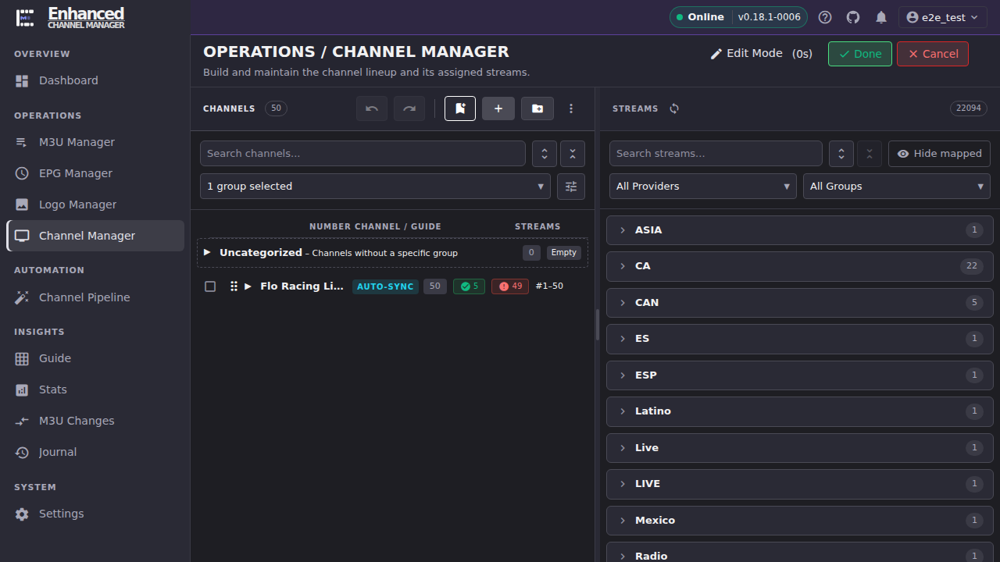
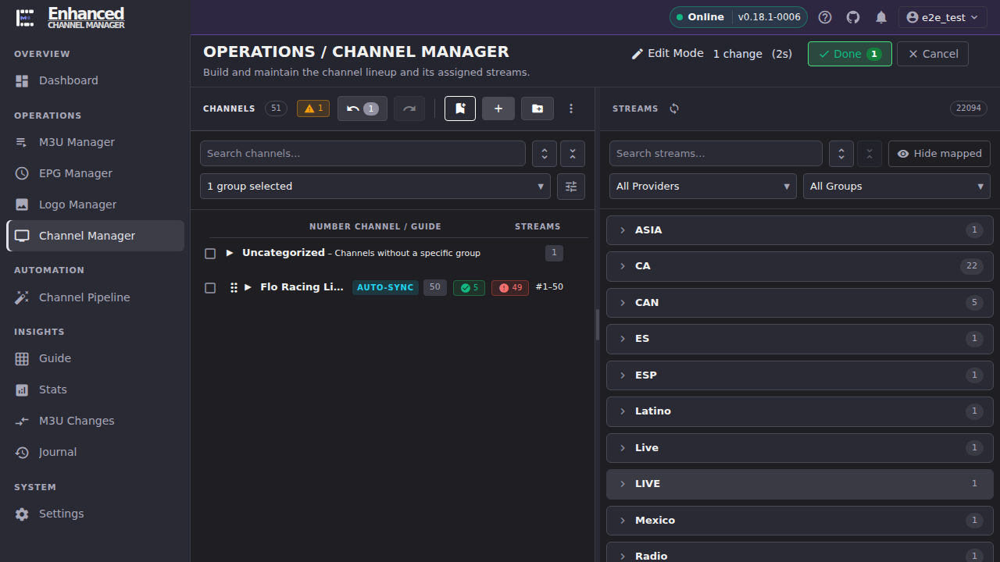
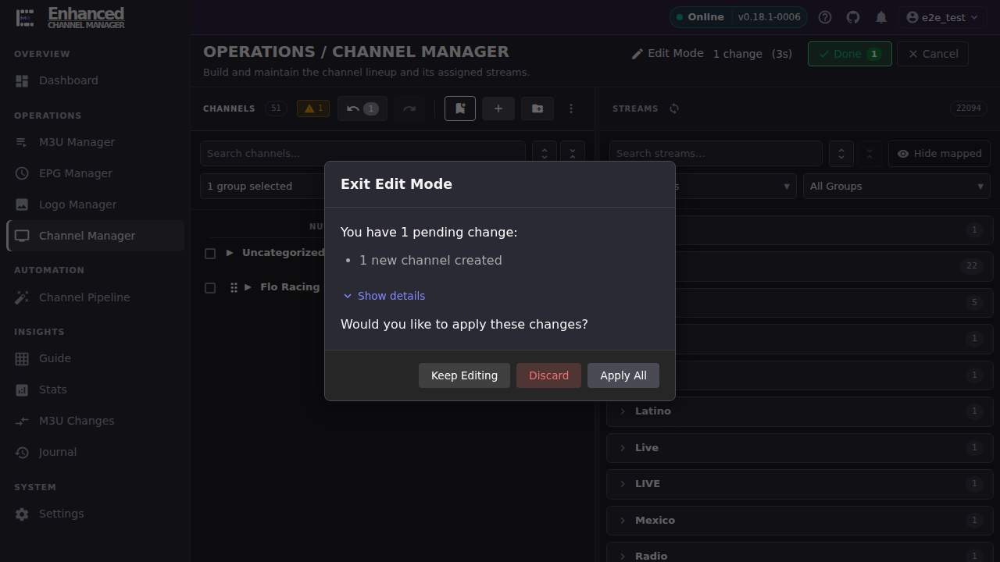

# Channel Manager

Channel Manager is where you build and maintain your channel lineup. Most of what you do here goes through **Edit Mode**, a staging area that batches your edits so nothing reaches Dispatcharr until you say so. But not everything is staged, and knowing which is which is the single most important thing on this page.

## Common tasks

### Turn on Edit Mode and see what changes

1. Open **Channel Manager**.
2. Click **Edit Mode** (top right).

**Result:** A new row of controls appears above the Channels panel: **undo**, **redo**, a bookmark-shaped **Create checkpoint** button, **Create new channel** (+), **Create new channel group** (folder), and **More actions** (⋮). The **Edit Mode** label grows a running timer, and a **Done** button and a **Cancel** button appear next to it.

Keep this in mind for everything below: **Create new channel**, **Create new channel group**, editing a channel inline, dragging a stream onto a channel, and **Delete** from the selection toolbar are all *staged*. They only take effect when you click **Done → Apply All**, they count toward the pending-change total, and **Cancel** or **Discard** throws them away like any other staged edit. The [Bulk Channel Operations](bulk-edit.md) article covers which multi-channel actions are staged and which write to Dispatcharr immediately. That distinction matters even more once you're acting on dozens of channels at once.

### Create a channel (a staged change)

1. With Edit Mode on, click **Create new channel** (the + icon).
2. Enter a **Channel Name** and, optionally, a **Starting Channel Number**, **Channel Group**, and channel profiles.
3. Expand **Normalization Rules** if you want your normalization rules applied to the name you typed. The panel previews what the rules will make of the name as you type it. Leave the toggle off to create the channel under the literal text you entered. Its starting position comes from **Settings → Channel Normalization → "Apply normalization by default when creating channels"**.
4. Click **Create Channel**.

**Result:** The channel appears in the Channels panel right away, but nothing has reached Dispatcharr yet. The **Edit Mode** label now reads **1 change**, a matching badge appears on **Done**, and the undo button shows a count of 1.

Editing an existing channel's name, number, or group inline, and dragging a stream from the Streams panel onto a channel, stage the same way. Each is one more entry in the undo stack and one more line in the change count.

### Apply your staged changes

1. When you're done making changes, click **Done** next to Edit Mode.
2. ECM shows an **Exit Edit Mode** dialog summarizing every pending change (for example, "1 new channel created"). Click **Show details** to see the itemized list.
3. Click **Apply All**.

**Result:** ECM commits every staged change to Dispatcharr in one batch, the dialog closes, and Edit Mode turns off. Open **Guide** or a media client pointed at ECM/Dispatcharr to confirm the change is live.

### Discard changes you don't want to keep

There are two ways to throw away staged work, and they land in the same place:

1. **From inside Edit Mode**, click **Cancel** (next to Done) at any point. ECM asks *"You have N pending change(s) that will be lost. Are you sure you want to cancel?"* Confirming discards everything staged so far and exits Edit Mode.
2. **From the exit summary**, click **Done**, then click **Discard** instead of **Apply All**.

**Result:** Every staged change is thrown away (the channel you created, the stream you dragged, the edit you typed) as if it never happened. Because nothing was ever sent to Dispatcharr, there is nothing on the Dispatcharr side to undo. Edit Mode turns off and the Channels panel reverts to exactly what it looked like before you opened it.

Discard only affects the *current* Edit Mode session. It cannot undo a batch you already applied with **Apply All**. That batch already reached Dispatcharr. For actions that write to Dispatcharr immediately even while Edit Mode is on (CSV import, merges), see [Bulk Channel Operations](bulk-edit.md). Discard does not touch those either, because they were never staged in the first place.

### Undo, redo, and checkpoints within a session

While Edit Mode is on:

- **Undo** (Cmd+Z, or Ctrl+Z on Windows/Linux) steps back through your staged changes one at a time, most recent first.
- **Redo** (Cmd+Shift+Z / Ctrl+Shift+Z) steps forward again through anything you've undone.
- **Create checkpoint** (the bookmark icon) opens a dialog where you name and save the current staged state. It's pre-filled with a running name like "Checkpoint 1". Use this before a large or risky batch of edits so you have a labeled point in your session, rather than clicking Undo one step at a time to get back to it.

**Result:** Undo, redo, and checkpoints all operate on the current staged batch only. Once you click **Apply All**, that batch is committed and there's nothing left in the undo stack to step through. A fresh Edit Mode session starts with a clean history.

## Going deeper

- [Bulk Channel Operations](bulk-edit.md): CSV import, bulk EPG assignment, Gracenote IDs, Find Duplicates, and Merge Channels for working across many channels at once, and which of those are staged vs. immediate.
- [Stream Deduplication](stream-dedup.md): what happens when a stream you're adding looks like it belongs to a channel you already have.
- [`docs/api.md`](https://github.com/MotWakorb/enhancedchannelmanager/blob/main/docs/api.md): the channel and stream API endpoints behind Edit Mode's Apply All commit.
- [`docs/architecture.md`](https://github.com/MotWakorb/enhancedchannelmanager/blob/main/docs/architecture.md): how staged edits are batched and sent to Dispatcharr.
