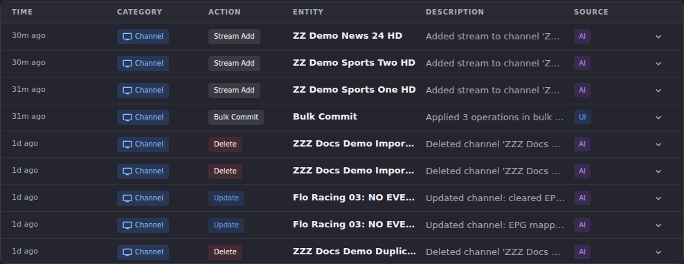

# Find Out What Changed on a Channel

The Journal is ECM's record of every change it made or observed. This article is the narrow version: how to use it to answer "what happened to *this* channel." For the page itself (all seven categories, the purge control, reading a diff) see [Journal](../journal/index.md).

## Common tasks

### Trace the history of one channel

**This now works regardless of how the channel was changed.** Edit Mode used to write only a **Bulk Commit** summary row for a whole session, so a channel touched only through the ECM interface had no row carrying its name and could not be found by searching for it. Edit Mode now writes a per-channel row for every change that reaches Dispatcharr, the same rows an MCP agent produces, so one search answers the question whichever surface made the change.

1. Open **Journal**.
2. Set the **All Categories** dropdown to **Channel**.
3. Type the channel's name into **Search entries...**. The search matches both the **Entity** and the **Description** of each row. Each row records the name the channel had at the time, so if the channel was renamed you will need to search both names to see its whole history.

*This screenshot predates the change described above.* It was captured when only MCP changes (**Source: AI**) produced per-channel rows, which is why its single **Source: UI** row is a lone **Bulk Commit** summary. On a current build, an Edit Mode session produces per-channel rows reading **Source: UI** as well.

**Result:** you get that channel's rows newest-first, with the **Entity** column showing the channel name and the **Description** column summarising what changed, for example *"Updated channel: cleared EPG mapping"*. Click a row to expand it into **Before** and **After** blocks with the exact field values.

The **Bulk Commit** summary rows are still there alongside them. They answer a different question ("when was this batch applied and how big was it"), and they still carry only aggregate counters, not channel names.

**When a Before block cannot be filled in.** Sometimes ECM applies a change without ever having read what the field held beforehand: the channel was created earlier in the same batch, a catalog read failed, or Dispatcharr does not return that field. The row now says so in words rather than showing you an internal placeholder:

> ECM could not read the previous value of *(field names)* — the change was recorded, but what these held beforehand is not known. <!-- em-dash-ok: verbatim quote of the string JournalTab renders -->

Any fields ECM *did* read still appear as normal under the same **Before** heading.

### Understand what you are looking at

Three things about these rows regularly trip operators up.

**The Action dropdown does not list every action ECM records.** It offers Create, Update, Delete, Start, Stop, Refresh, Stream Add, Stream Remove, Stream Reorder and Reorder. Merges and Edit Mode's own commit are recorded under action types that have no entry in the list, so they show up in the table (as **Merge** and **Bulk Commit** badges) but cannot be filtered *to*. If you are hunting for a merge or for the moment a batch was applied, leave the dropdown on **All Actions** and use the search box instead.

**An Edit Mode session does not produce exactly one Bulk Commit row.** It used to, and the guidance to expect one was wrong even then for large sessions. **Apply All** does not send everything in a single request: it sends one request for the channels it is creating, and then one request per 200 remaining operations. Each of those requests writes its own **Bulk Commit** summary row, so a small session writes one or two and a large one writes several. Each summary's counters describe **its own request**, not the whole session, which is why the numbers in one row will not add up to what you did overall.

What ties them together is the **Batch** identifier: every request in one **Apply All** shares a single batch id, and so do all the per-channel rows written underneath them. A change made through an MCP agent writes its own per-channel row with no Bulk Commit summary alongside it. See [Trace the history of one channel](#trace-the-history-of-one-channel) above for what this means when you're hunting for one channel's history.

**The Source column separates you from automation.** **UI** means the change came from the ECM interface, **AI** from an MCP agent, **Scheduler** from a scheduled task, and **Channel Pipeline** from a rule run. When a lineup changes overnight and nobody touched the UI, the Source column is the first thing to read.

### Find the rest of a batch

1. Expand a row that was part of a batch. The detail area shows **Batch:** followed by an identifier.

**Result:** Every change applied together shares that identifier, but the Journal page only displays it: it is not a link, and there is no batch filter in the filter row (Category, Action, Source, and free-text search only). From the UI, the closest you can get is searching for something the rows have in common, such as a shared description fragment or time window. Making the Batch id clickable, or adding a batch filter, is not available today, and there is currently no way to reconstruct a batch precisely by its id from the ECM web UI.

## Going deeper

- [Journal](../journal/index.md): the full page, including the other categories, reading the Before/After diff, and purging old entries.
- [Channel Manager](channels-overview.md): the Edit Mode session that produces the Bulk Commit rows.
- [Bulk Channel Operations](bulk-edit.md): the operations that write straight through, which is what you are usually chasing when a channel changed and there was nothing to undo.
- [`docs/api.md#journal`](https://github.com/MotWakorb/enhancedchannelmanager/blob/main/docs/api.md#journal): the API reference for the Journal, including the batch id filter, useful if you want to query it programmatically instead of filtering in the UI.
