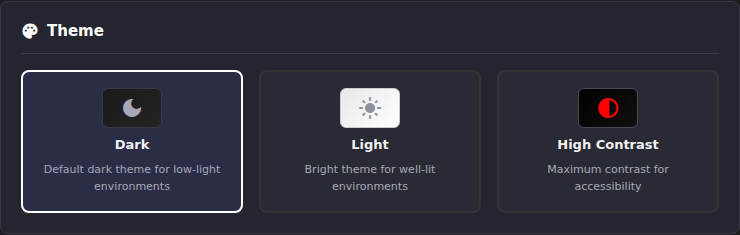

# Appearance

Appearance, under **Workspace** in the Settings navigation, is
**instance-wide, not per-user**. Every setting on this page, including
theme, is shared by everyone who signs in. Two operators using the same
instance share one theme and one date format; whoever changes it changes it
for everyone.

## Common tasks

### Switch theme

1. Go to **Settings → Appearance**.
2. Under **Theme**, click **Dark**, **Light**, or **High Contrast**.
3. Save.

**Result:** The new theme applies immediately across the app for every
signed-in operator, not just you.

### Change how dates are displayed

1. Go to **Settings → Appearance**.
2. Under **Date Format**, choose a format, or leave it on **Automatic** to
   match each viewer's own browser locale. A live preview shows the
   selected format.
3. Save.

**Result:** Every date and time shown across the app follows the new
format. "Automatic" is the one setting on this page that *can* look
different per viewer, because it reads each browser's own locale rather
than a stored value. Everything else here is shared.

### Hide sensitive URLs before a screen share or screenshot

1. Go to **Settings → Appearance**.
2. Under **Display Options**, check **Hide EPG URLs** and/or **Hide M3U
   URLs** to prevent those source URLs from appearing in the EPG Manager
   and M3U Manager destinations.
3. Save.

**Result:** The hidden URLs no longer render in those destinations for any
operator on the instance, until unchecked again.

### Choose what happens when Auto-Sync groups overlap across providers

1. Go to **Settings → Appearance**.
2. Under **Display Options**, review **Allow multi-provider auto-sync on
   shared groups**. Dispatcharr channel groups are global. A group with
   the same name on two M3U providers shares one underlying group ID. By
   default ECM locks a group's Auto-Sync controls to whichever provider
   enabled it first, to stop two providers from silently double-creating
   channels for the same content. Only enable this if you specifically want
   multiple providers auto-syncing the same shared group.
3. Save.

**Result:** With the option off (default), a shared group's Auto-Sync stays
locked to its first provider. With it on, other providers can also
auto-sync that group. An informational icon still marks groups shared
across providers either way.

### Choose how "Open in VLC" and browser stream preview behave

1. Go to **Settings → Appearance**.
2. Under **VLC Integration**, set **Open in VLC Behavior**. Under **Stream
   Preview**, set **Browser Playback Mode**. Transcode is more compatible
   with AC-3/E-AC-3 audio than Direct Playback, at the cost of backend CPU.
3. Save.

**Result:** Clicking "Open in VLC" or previewing a stream in the browser
now follows the selected behavior.

If **Open in VLC Behavior** relies on the `vlc://` protocol and your OS
doesn't already have a handler registered for it, the same VLC Integration
section offers a platform setup script: a PowerShell script with registry
setup for Windows, a shell script that creates a `.desktop` file for
`xdg-open` on Linux, and a shell script that creates an AppleScript handler
on macOS. Download the one matching your OS and run it once; after that,
`vlc://` links open VLC directly.

### Set the User-Agent for direct previews and probes

Under **Settings → Appearance → Stream Preview**, choose **Stream User-Agent**
and click **Save Settings**. One selection applies to new direct stream previews
and ECM probes: metadata, bitrate, resdet resolution, and black screen scans.
An in-progress probe keeps its selected identity through its substeps and retries.

- **Use Dispatcharr User-Agent (Default)**: use the stream's M3U account UA,
  then Dispatcharr's global default. Core StreamProfile UA is not part of normal
  live playback resolution.
- **Chrome**, **Firefox**, **Safari**, **VLC**, **TiviMate**: send a fixed
  compatibility identity instead. These presets represent Chrome 132,
  Firefox 135, Safari 17.6, VLC/LibVLC 3.0.20, and TiviMate 5.1.6 on Android 12;
  they are not claims to be the latest browser/player releases.

Without either Dispatcharr UA setting, ECM uses `Dispatcharr/{version}` when
version metadata is available, otherwise logs and sends `Dispatcharr/unknown`.
Failed configuration reads and malformed UA headers produce a safe error rather
than silently switching identities. This fallback is an ECM compatibility choice
for missing metadata, not exact equivalence to every Dispatcharr release.

**Channel previews** use Dispatcharr's TS proxy. Dispatcharr controls that proxy's
provider UA; this ECM selector cannot override it. Non-HTTP transports have no
HTTP User-Agent header. Changing this setting also does not give ECM Dispatcharr's
VPN/network route. If preview returns a DNS or connection error, check connectivity
from the ECM host/container.

If playback stops after it starts, check ECM's `[PREVIEW]` warnings for an
upstream streaming failure or an abnormal decoder exit code. These failures
abort playback; they cannot replace already-sent HTTP headers with a JSON error.
Normal viewer disconnects do not produce decoder-failure warnings. HTTPX request
URL logs stay suppressed even at DEBUG level to protect provider path/query tokens.

### Clear old toast notifications

1. Go to **Settings → Appearance**.
2. Under **Notifications**, click **Clear Read** to remove read
   notifications from the history, or **Clear All** to remove all of them.

**Result:** The bell-icon notification history reflects the change
immediately. This only clears history. It doesn't affect configured alert
methods; those are configured under **Settings → Notification Settings**,
not here.

## Going deeper

- [Notifications & Alert Methods](../notifications/index.md): configuring where alerts actually go (SMTP, Discord, Telegram); this page only manages toast history.
- [Getting Started](../getting-started/index.md): first-run defaults, if you haven't touched Appearance yet.
